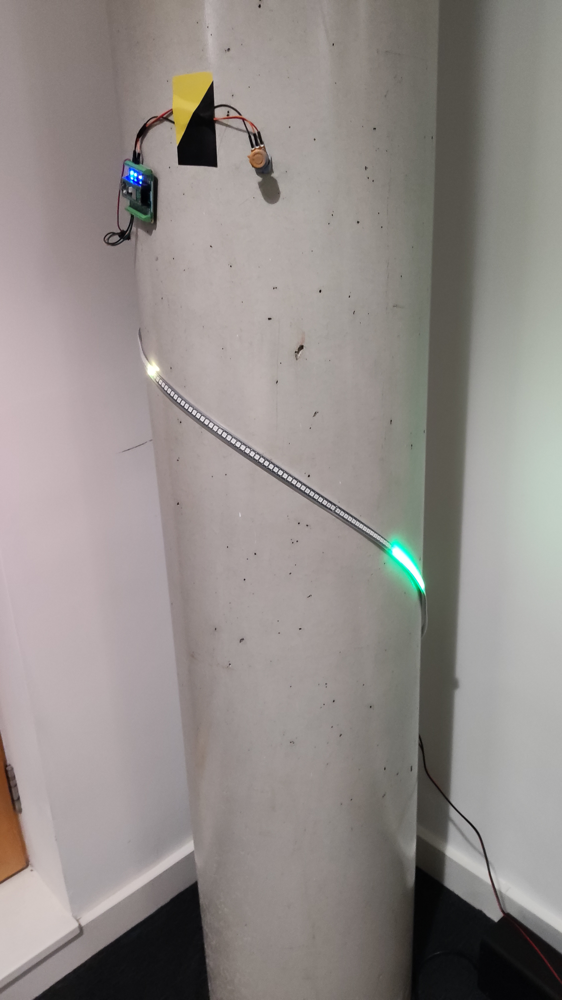
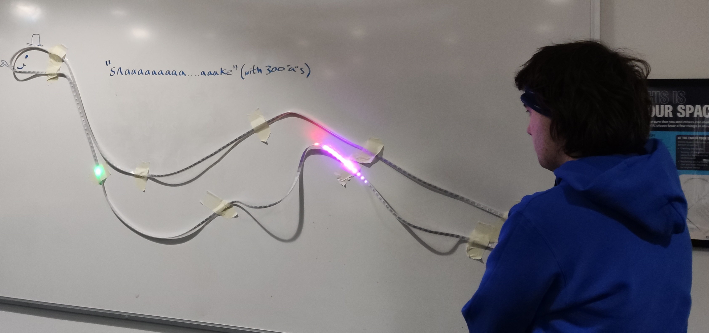

As part of the IGGI game jam 2025 I put together a simple framework/engine for implementing 1 dimensional games.

This is because I've been accumulating LED strips and bits of electronics, and wanted to build myself a starting point for hacking together simple games that use simple input controls, and output to a LED strip. During the jam I put together this simple engine and framework (called ▄ ▄▄▄ ▄▄▄ ▄▄▄ ▄▄▄ ▄▄▄ ▄ ▄), and made some simple games as examples.

There is more [information on implementation in the github repository](https://github.com/bkirman/1dGameEngine).

The two games I made in the jam are Snaaaaaaa(300 a's)aaaaake, that is a version of snake using a 1 dimensional playing space, and Twisty Bird, a version of flappy bird that is controlled using a rotating knob.

As you can see, one of the interesting things about the strips is how they are arranged in 3d space. For example twisty bird I arranged around a pillar, so players had to play based on diffuse reflections on the white walls. Snaaa...ake gets much more difficult the more twists and turns there are in the strip.

I do need to take some better photos or videos to show how it works in practice, and not in a soulless university building.

