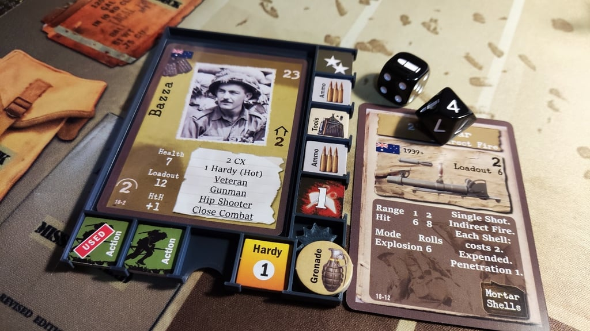
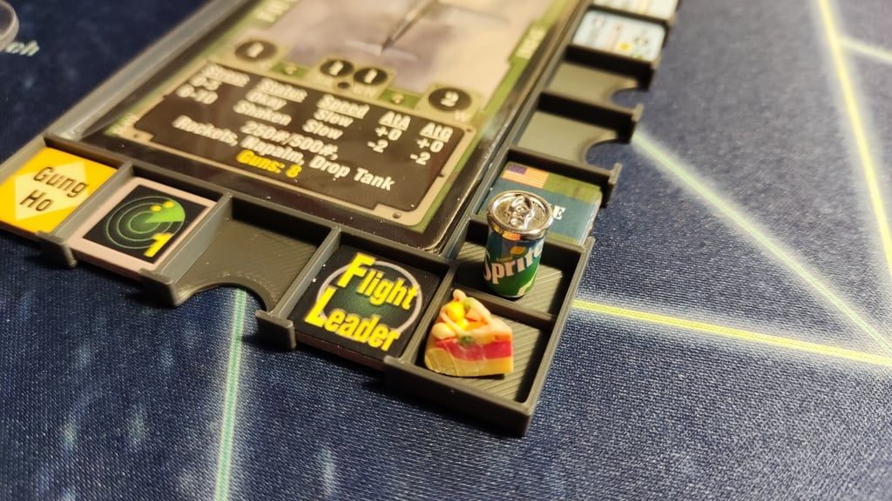
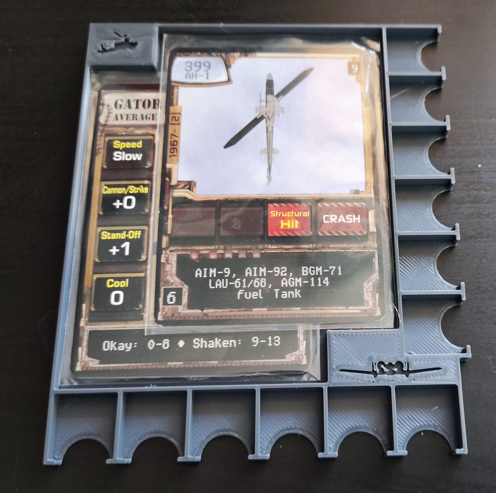

I mentioned [elsewhere](/bits/leader-squadron) I quite like the [DVG](https://boardgamegeek.com/boardgamepublisher/3683/dan-verssen-games-dvg) solitaire series of light, action-movie-oriented wargames. 

A common feature of these games is having a collection of pilots or soldiers, or tanks or whatever, that have a bunch of tokens associated with them. For example, actions, ammo, stress, ordnance, etc. I designed and made this "sled" to be 3d printed, that is compatible with a wide range of games. It keeps the tokens tidy, and allows them to be easily swapped and moved around.

The sleds have proven pretty popular and I'm glad they help people out. I printed out 12, and use them every time I play. I've also made variants for different versions of the games (including some unpublished ones), different sized card sleeves, orientations, etc. 

[Download the sled STL collection directly](/stuff/dvg/dvg_sleds_stl.zip) or see the [different variations on Thingiverse](https://www.thingiverse.com/thing:5870832).

