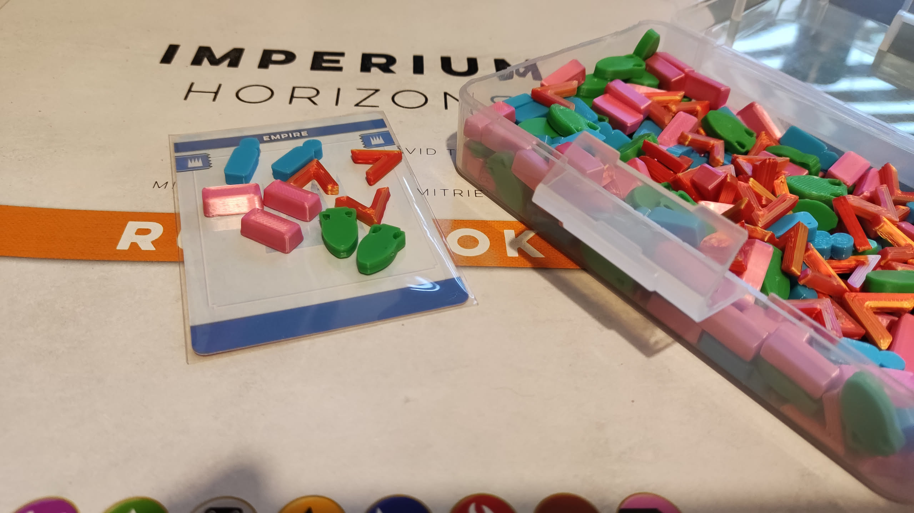

Some clean, simple and small tokens to use in place of the cardboard chits in games of Imperium. I printed about 40 of each type and that is enough for 1-2 players. You might also scale up some to act as "10s" if you wanted. 

Before you print have a think about the scale you want - I like them around 15mm each (see the photos), but the chamfered edges don't print that 100% cleanly, and the amphorae loops close up a little. On FFF printers, depending on how your first layer goes down you might prefer larger pieces that are less likely to get nudged off the plate during printing. Also consider scaling them in the depth axis if you prefer them to be thicker. They only take a couple of minutes to print each, to test different settings.

[The files are also on Thingiverse](https://www.thingiverse.com/thing:7170145).

Imperium is by Nigel Buckle, Dávid Turczi and published by Osprey games. [More info on BGG](https://boardgamegeek.com/boardgame/367518/imperium-horizons).

