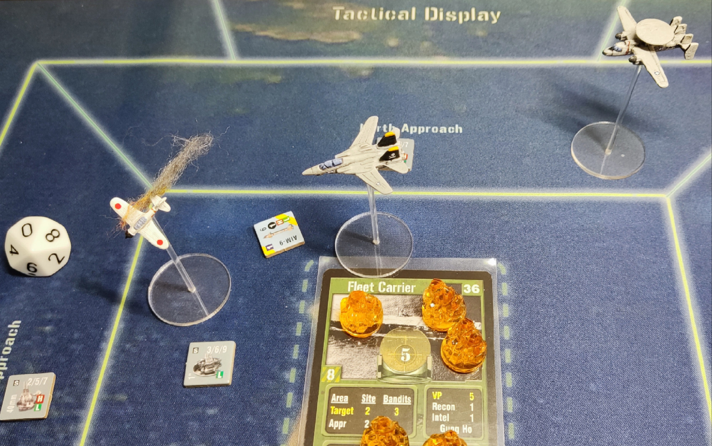
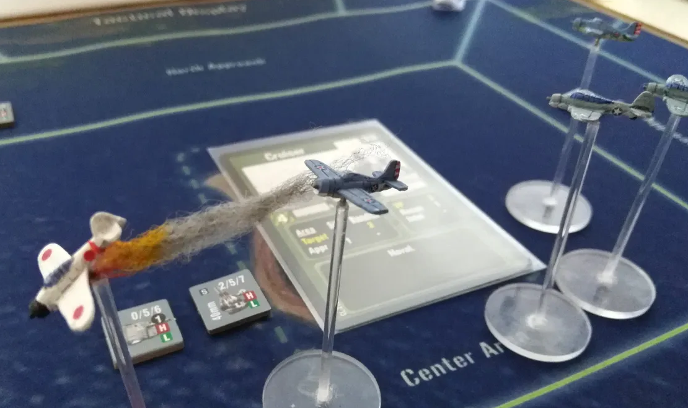

I'm a fan of the [DVG "Air Leader" series of board games](https://boardgamegeek.com/boardgamefamily/3268/series-leader-dvg). I like these games because they are the right depth of wargame for me, and about planning with lots of options, not worrying about historical details too much. I like my games to feel like camp action movies rather than the misery of actual warfare. Each Air Leader game is short, thematic, not too difficult, and I get to make pew-pew noises with neat little planes, and imagine beach volleyball games with the pilots 🏝️.

In these games, there is an optional rule to select squadrons at random, and this is my favoured way to play. But it takes a long time to prepare. The Leader games, especially later ones, are maximalist and have hundreds of different pilots and planes, which make it very complicated. As a bit of a mini-project I spent a few evenings bashing something together to help me speed up the setup. There is also something weirdly therapeutic about organising data into [structured JSON files](https://github.com/bkirman/RandomLeaderSquadron/tree/main/src/data) (don't judge me!).

There are a few examples of this kind of tool, such as [FragDaddy's DVG Leader Games squad randomizer](https://boardgamegeek.com/filepage/226394/dvg-leader-games-squad-randomizer) and [Blue Maxima's Warfighter randomiser](https://bluemaxima.org/warfighter/).

However I wanted to make a version of this tool that was:
- Web based
- Allows 'nudging' criteria and final selection (balance squad, eliminate specific aircraft)
- Focussed on year instead of campaigns (to support custom campaigns)
- Not too bothered about accuracy, and flexible enough for silly things to happen.

Built on:
- Vanilla JS, HTML and CSS
- Uses the Orbitron font (OFL)

[The generator is available here](https://ben.kirman.org/stuff/airleader/).

