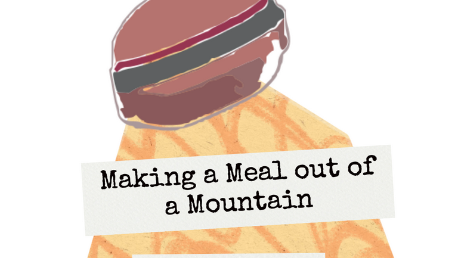
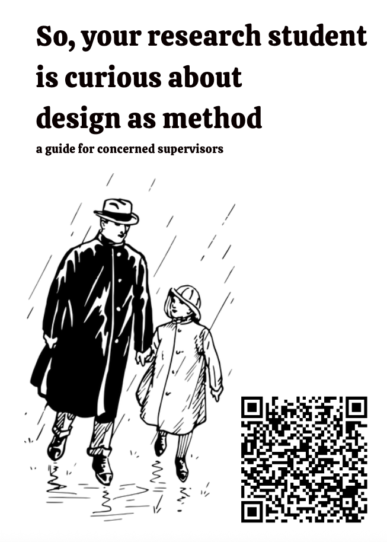

Oliver and I have been talking about Research through Game Design for a while, and this is a first attempt at sharing something with colleagues. We talked about it, and gave copies away, at British DiGRA 2025 in Birmingham.

[Download the zine](/papers/Bates2025MealMountain.pdf)

We also made a bit of a [living document or guide to RtGD](https://docs.google.com/document/d/1rJnQSeqzuC2X836kDcMad-yaQqBkIrCMzIhtdFxhvEo/edit?usp=sharing) and our thinking.
