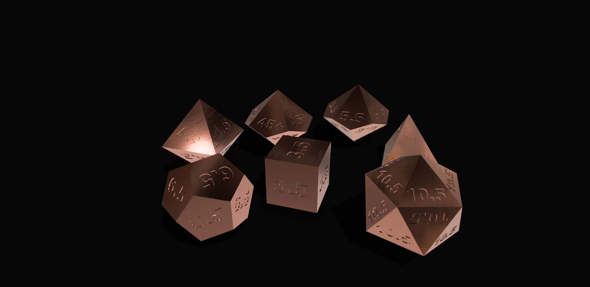
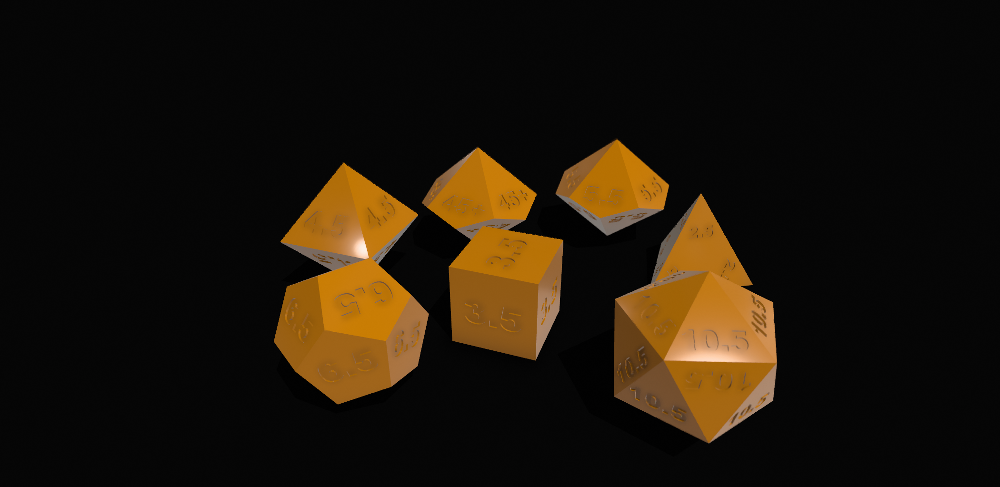
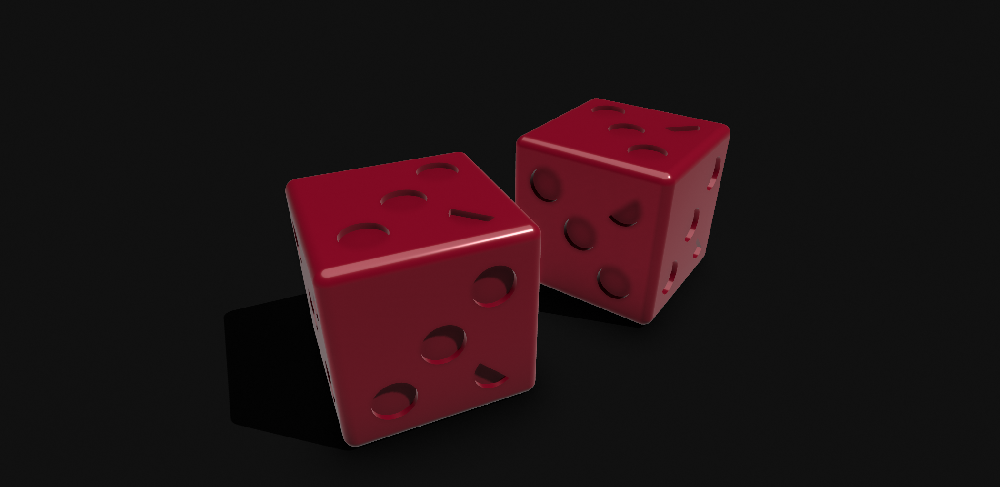
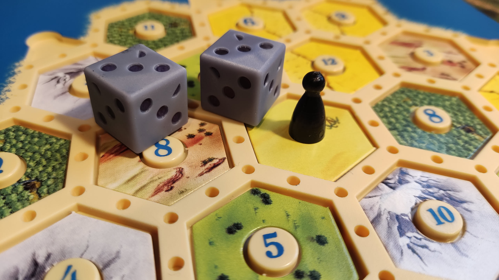

If you find normal dice too swingy, I have designed a set of custom dice that give the average (mean) result of each roll. This is perfect for players who don't like how dice give so many different results, and prefer consistency in their rolls.

The d100 works slightly differently than normal. You roll both the d10s and add them together, instead of reading as tens and ones. Because of maths.

Unfortunately I have not been able to test the weight distribution of the dice, so some faces might be microscopically more likely to occur due to the volume of material in different sides/arrangement of numbers, just as in regular dice. However I can guarantee this will not affect the statistical probability of the final result.

It is also available on [itch.io](https://benkirman.itch.io/mean-dice) and [Thingiverse](https://www.thingiverse.com/thing:7165123). The RPG dice are based on [these blank dice from Dino340](https://www.thingiverse.com/thing:4817039). The 3.5 pip dice I made from scratch. 

CC-BY-SA-NC

This is an offshoot of a larger project, called IAAIYAPABG. More later. What I like about this is the "taking a stupid joke too far". I spent so long editing the d4, which has numbers on every vertex... and then it took 2 attempts to print using that translucent photopolymer, which is not great with sharp edges. So dumb, the whole joke could have been a tweet...

It could also form the basis of some kind of satirical game like "Decolonisers of Catan"

This idea has been done [better](https://dailyworkerplacement.com/2017/05/19/unsettling-settlers-of-catan/) and [more thoughtfully](https://analoggamestudies.org/2015/11/the-first-nations-of-catan-practices-in-critical-modification/) before.