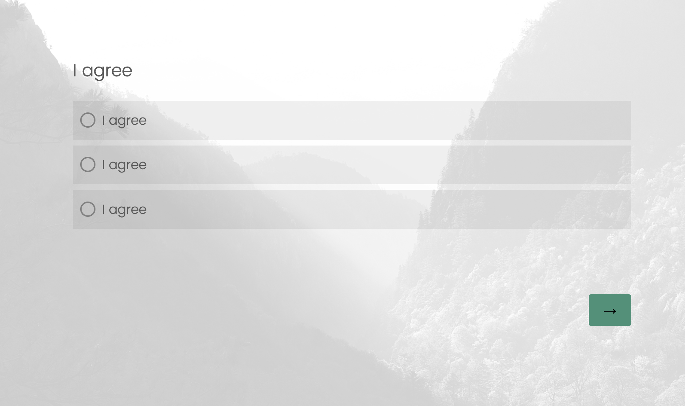
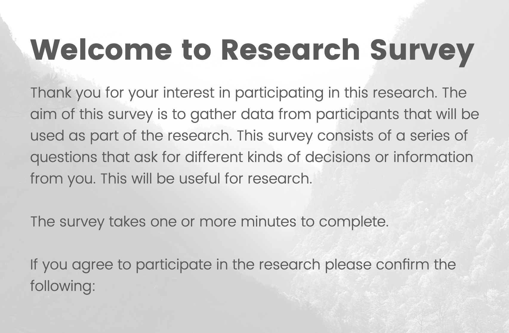

Another year, another IGGI game jam. I really value the jams as a space to do something small, experimental, weird and disposable. This year I started working with an LED array, but one of the suggested diversifiers was around using Qualtrics/Google Forms as a game engine, and I ended up giving that a go instead.

I'm not fully happy with the finished product, I think it needs some narrative work, and a better flow, but it was fun messing around inside Qualtrics trying to get it to do some weird things. Survey platforms are essentially [Twine](https://twinery.org/)-like - they offer different options, and ways to branch, selective logic, options for randomness, and have a certain flow to them. It was cool to experiment in this space for a while, and I reckon it would make a good general constraint for a jam.

You might not have come across [Qualtrics](https://www.qualtrics.com/en-gb/) before, but it is quite familiar software to academics because it is a popular one for running data collection experiments with human participants. It has a really robust set of features that support surveys and questionnaires, and (limited) pre-analysis/validation of results, that is designed to fit with the constraints we have when collecting research data. For example, randomising sets of questions, offering integration to Javascript, strict data management, etc. Compared to a lot of software we have to use in our work, Qualtrics is kinda pretty ok, actually. I've used it a lot, and it was fun to approach this familiar bit of software from a different angle.

Anyway, the game I made is called [**Research Survey** and it is available to play online](https://benkirman.itch.io/research-survey).

I'd also suggest checking out [the other games from the jam](https://itch.io/jam/iggi-jam-2026/entries), and especially _[The Office for Public Assistance](https://alexlflint.itch.io/tofpa)_, another take from the jam on using Qualtrics as a game engine, and a better and more coherent one at that.

