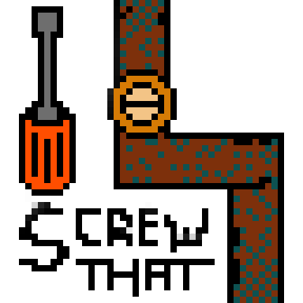

It's a game made with Oliver, where you simulate resource scarcity by turning off random water supply valves in your home, and dealing with the consequences.

One of the things I love about working with Oliver is how fast stuff happens. If it is me, I agonise over decisions and take months to achieve things. With Oliver, a brief brainstorming session about research and game design, and a bit of a joke about practical things about plumbing, and before you know it, Oliver has released a zine LARP/game.

In particular things like "The game ends when it ends." are great - sometimes just enough of a game is just enough.

[More information on Screw That on Oliver's itch.io page](https://oliverbates.itch.io/screw-that).

There is a sister game, where you flip switches in your electrical consumer box, called Flip That.

