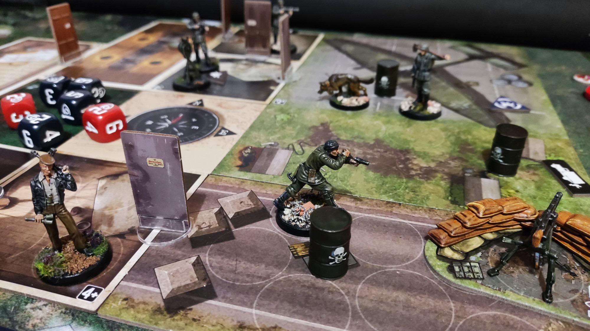

[V-Sabotage](https://boardgamegeek.com/boardgame/163474/v-sabotage) is another favourite solo game, about controlling a varied group of commandos infiltrate different situations in WW2. It is very much the board game spritual successor to the [Commandos](https://www.youtube.com/watch?v=dU6yBx8eVI0) video game series. 

I like it, it's quick, fun, evocative and has nice bits. It also has a complicated collection of rulebooks that are great for learning the game, but less good for quick reference. Because I only play infrequently I made an aide that gives me the reminder of the key details I tend to forget (do you start in tunnels? does being visible raise the alarm?)

That's it - print on A4, fold in half and laminate if you want.
- [The final PDF ready for printing](/stuff/vsabotage/aide.pdf).
- [The Affinity Publisher source file](/stuff/vsabotage/aide.afpub).

<object data="/stuff/vsabotage/aide.pdf" type="application/pdf" width="100%" height="500px"></object>

