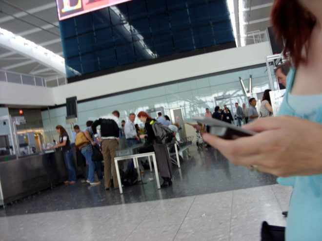

(2012) The notorious mobile game played in real airport security

Blowtooth is a unique game where players must smuggle virtual contraband through real airport security. Of course, no actual crimes are committed - the game uses bluetooth to store a list of devices that are broadcasting during the airport check-in process. Later, players are challenged to find those same devices in the departure lounges.

The game only works when you are in a real airport. It was developed to explore the limits of pervasive gaming in public spaces where the constant surveillance of law-abiding and innocuous behaviour has become the everyday norm.

It challenges passengers to reconsider their position and their relationship with the faceless airport security infrastructure. If you will be treated like a smuggler in the game of security, why not engage with that in your own, playful, way?

It is part of a collection of projects, including GetLostBot, Feckr and Fearsquare that use the geolocative capabilities of mobile phones to explore unconventional kinds of interactions in real spaces.

Ben Kirman, Conor Linehan and Shaun Lawson (2018) Reorienting Geolocation Data through Mischievous Design. In Mark Blythe and Andrew Monk (Eds) _Funology 2: From Usability to Enjoyment_. Springer.

[Kirman, Ben and Linehan, Conor and Lawson, Shaun (2012) Blowtooth: a provocative pervasive game for smuggling virtual drugs through real airport security. Personal and Ubiquitous Computing, 16 (6). pp. 767-775. ISSN 1617-4909](http://eprints.lincoln.ac.uk/6479/)

[Linehan, Conor and Kirman, Ben and Lawson, Shaun and Doughty, Mark (2010) Blowtooth: pervasive gaming in unique and challenging environments. Proceedings of the 28th of the international conference extended abstracts on Human factors in computing systems . pp. 2695-2704](http://eprints.lincoln.ac.uk/2313/)
