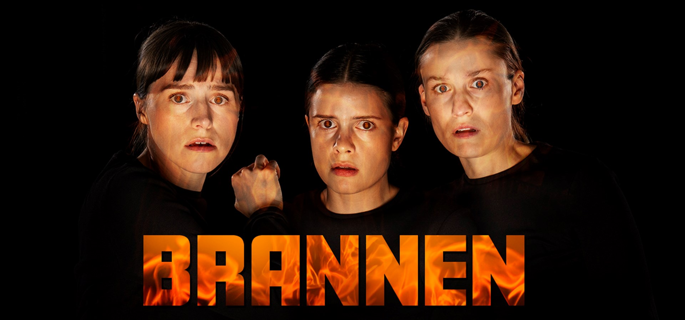
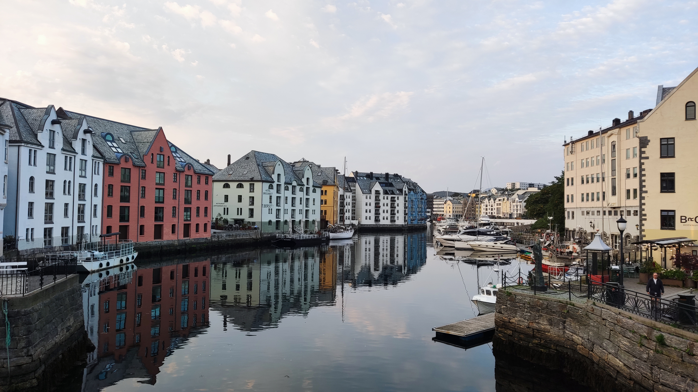
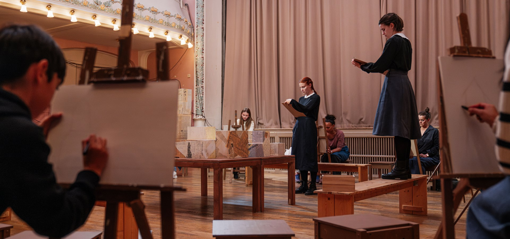
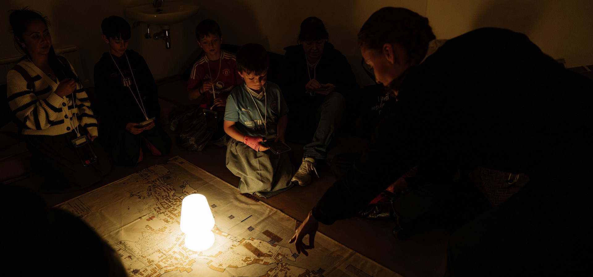
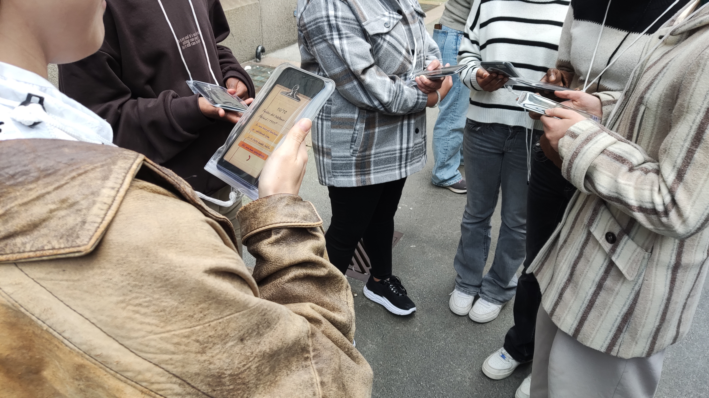
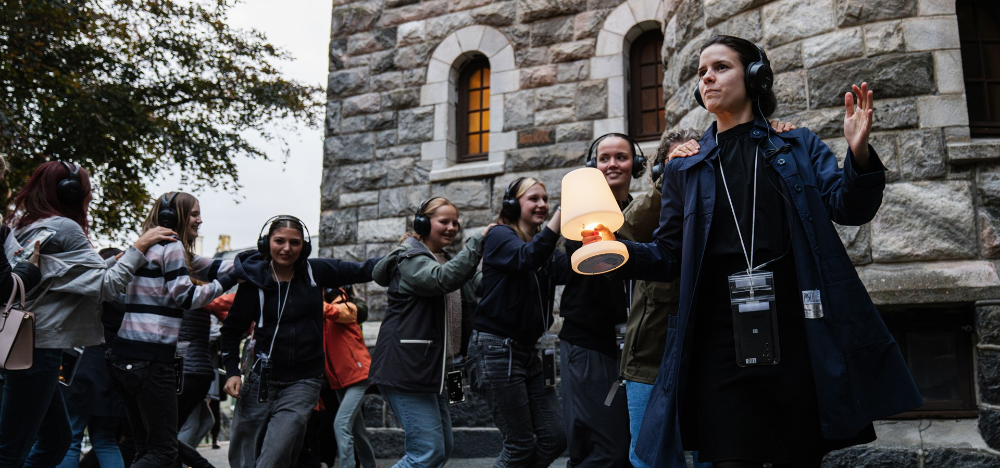
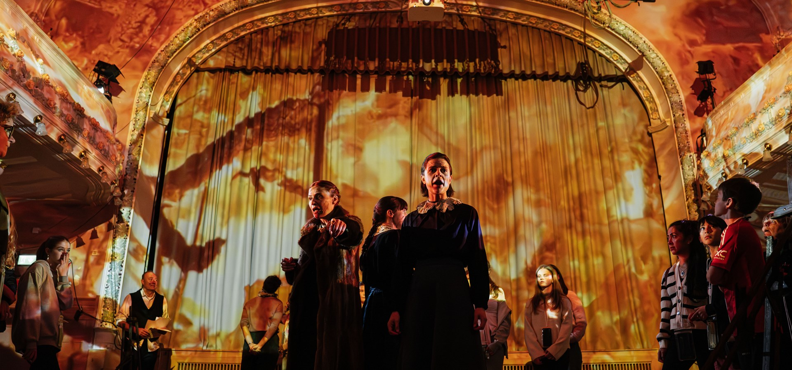
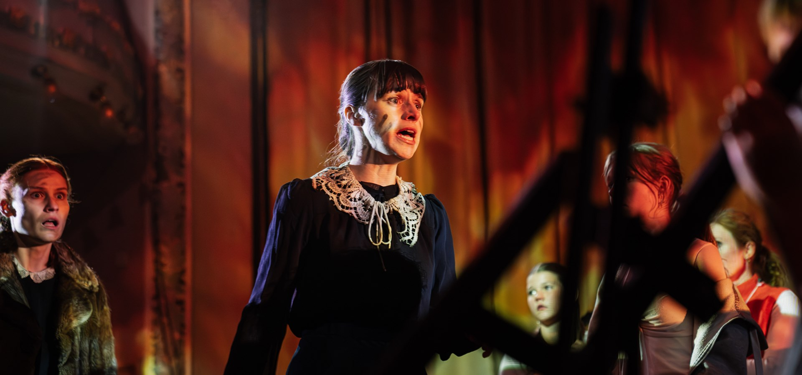
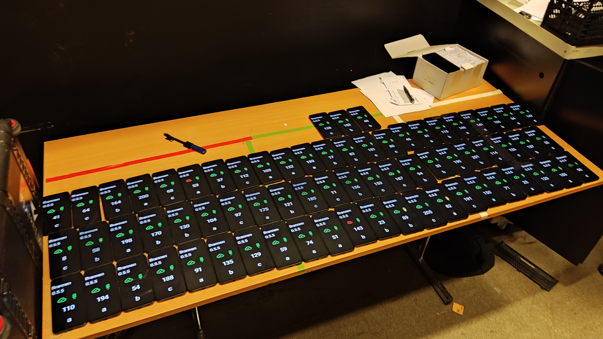

*Brannen* ("The Fire" in Norwegian) is a production I worked on with [Teatret Vårt](https://www.teatretvart.no/) in Ålesund and Molde, Norway, as part of the [PlayOn!](/projects/play-on) project. It was written by [Liv Heløe](https://en.wikipedia.org/wiki/Liv_Hel%C3%B8e), directed by [Odette Bereska](https://de.wikipedia.org/wiki/Odette_Bereska) and starred Amalie Ibsen Jensen, Ingrid Myhre Løvik, Anne Wiig, and Jørn Morstad. [Full credits are on the PlayOn website](https://play-on.eu/vart-outreach/).

Brannen is one of the "third phase" productions in PlayOn, that had previously looked at game elements, and immersive technology. The third phase is on "immersive outreach" and specifically using technology as a way to bring the theatre outside and explore the storytelling opportunities in mixing environment with technology.

For Brannen, this gave an opportunity to tell a youth audience the story of the 1904 fire that devastated the small city of Ålesund, and the 1916 fire in Molde. The fire in Ålesund has [interesting historical significance](https://en.wikipedia.org/wiki/%C3%85lesund_fire). Although large areas of the city were destroyed, there was only one recorded death. Thanks to investment from Kaiser Wilhelm the city was rebuilt in stone following the [Jugendstil](https://en.wikipedia.org/wiki/Jugendstil) that has made Ålesund a particularly picturesque city with huge (although [environmentally problematic](https://www.forbes.com/sites/davidnikel/2023/03/16/why-norwegian-fjords-cruises-will-soon-change/)) tourist draw.

Since the city is very compact, it is possible to follow the path of the fire directly in the city, and see the effect on the nearby streets and architecture. The concept of Brannen, was to tell the story of three girls from different walks of life, and how they responded to the fire in the moment, and the lasting effects on them and their city. The overarching theme is that of perspective, and understanding the social history of the city but also the surprising renewal that the fire brought.

As part of telling this story, the audience begins in a shared classroom environment, to bring them into the world, and are then separated into groups. Each group follows one of the characters home and experiences some of their home life through a combination of real world props, and immersive phone apps that showed images, animations and audio from their lives. 

At this point the groups leave the theatre and follow an audio-guided route through the town, stopping at key locations to see how they look now, and also to learn about how life was in 1904. At some point later the alarms sound and the audience must escape, following guidance, and hearing through immersive audio the fire burning around them as they retreat. The climax of the show is returning as the theatre burns, and then dealing with the aftermath.

During the show there is lots of interaction from the audience, as they make decisions about what the girls should do, that the actors respond to directly (should they ask for money to go to the dance?). Later, they must help the girls escape, and also deal with dilemmas as the city burns (should they unlock the prison gates?). This interaction is all through a custom mobile application I built using [OnScene](/projects/onscene) with the visual designs of set and costume designer [Anja Furthmann](https://www.operabase.com/anja-furthmann-a39555/en).

This was enhanced through tremendous work from audio designer [Cisser Mæhl](https://cissermaehl.com/) and video designer [Sara Artang](https://www.aggregatkunst.com/artists/sara-artang/). A special highlight was how the set converts during the exterior segment, into an immersive experience of the fire using projection mapping, rich audio landscapes, and special burnt versions of the props.

For me this was a fantastic experience, and a great example of the international cooperation at the heart of [PlayOn](/projects/play-on). It was great to put [OnScene](/projects/onscene) to the test for a highly demanding performance, with 80 simultaneous audience members interacting with the app sometimes individually, sometimes in groups and sometimes altogether. It was really great to see moments where we had audience vote on decisions, and see the vote results live on their own phones, and how this brought together the groups. The orchestration was also challenging - we had technicians monitoring the show remotely from the theatre using GPS tracking on the devices, who could also trigger key events during the show. In addition, the actors had the ability to control the experiences of their sub-groups of audience members. For example, to show something in their homes or to move on during the audio walk. It was great to see how enthusiastic the actors were about this role, and how it played into their performance.

Brannen serves as an excellent case study in the use of phones and game mechanics in outdoor theatre performances, that I am working on writing up.

Photographs (except 2,5,9) &copy; Teatret Vårt.