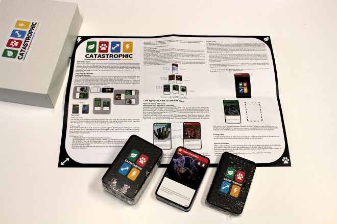
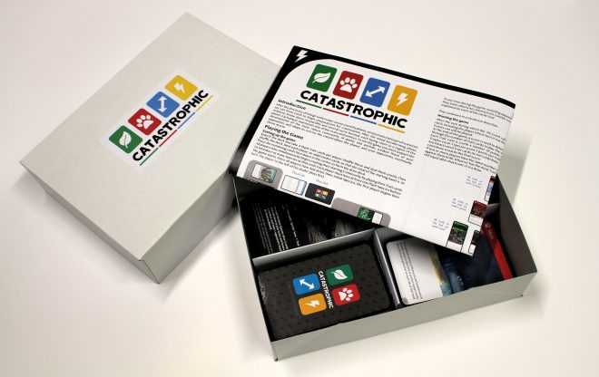
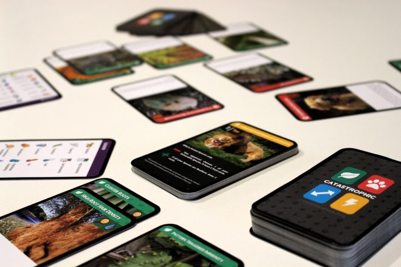

(2018) A card game to support students' systemic learning in Biology

Catastrophic is a project led by [Pen Holland](https://www.york.ac.uk/biology/our-staff/pen-holland/) in the [Department of Biology](https://www.york.ac.uk/biology/), along with [Kerry Knox](https://www.york.ac.uk/education/our-staff/academic/kerry-knox/) ([Education](https://www.york.ac.uk/education/)), [Florian Block](http://florianblock.net/) and myself ([DC Labs](https://www.digitalcreativity.ac.uk)/[TFTI](https://www.york.ac.uk/tfti)).

The aim of this project is to build a game to support student learning on concepts of Biology, especially incoming undergraduates. As with most degree programmes, the first year of Biology study is often about ensuring students have a solid grounding of subject knowledge. However students often perceive that as "bitty" as they cover lots of topics very quickly. However, all this knowledge is important, and it is all connected within the larger systemic/synoptic understanding of biological processes and relationships.

Catastrophic as a game, is designed to reinforce this synoptic aspect of the first year of higher education in Biology.

In the summer of 2018, we brought together a group of students from the Biology programmes (Katylily Westbury-Hawkins, Matthew Topham and Rosie Murton), and a couple of [DC Labs Summer School](https://www.digitalcreativity.ac.uk/projects/catastrophic-game-connections-collaborations-cross-disciplinarity-summer-school-2019) students (Matthew Shepherd and Ruta Czaplinska), to design and build the game.

They did excellent work, investigating lots of existing board and card games about biology, and designing their own that fits within the syllabus. The design went through multiple iterations, blind playtests and, as you can see, did excellent work with the graphic design and production. In October 2018 we had over 200 copies professionally printed, and these were distributed for free to all new students on the Biology degree programme.

In addition, a set of three small expansions were developed, that have been slowly released to students over the course of the year to coincide with topics being introduced in formal teaching. Students have also been invited to regular play sessions to engage with each other around the game.

It is currently undergoing the first year of trials, and we aim to release a new version over summer 2019 revised based on feedback from players.

In the meantime you can see the game at [BoardGameGeek](https://boardgamegeek.com/boardgame/263422/catastrophic) and download the source files from [the official website](https://catastrophic.york.ac.uk/).
