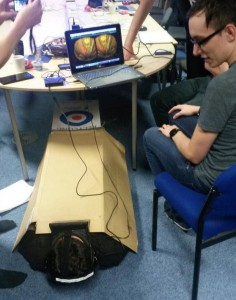
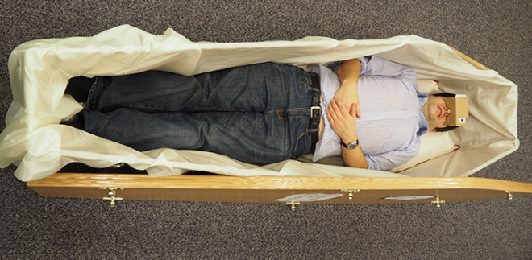
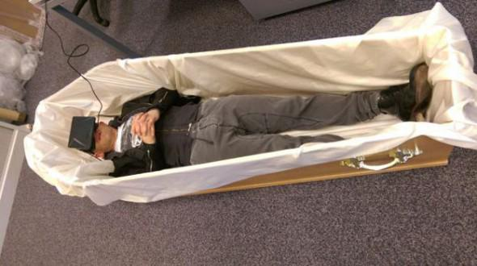

(2014) Coffins as game controllers, uncomfortable interactions and death in VR As you're aware, if you die in VR you die in real life. I'm very interested in uncomfortable interactions, and in particular the idea of using cultural associations to enhance interactive experiences. Recently, along with an MSc student I co-supervise (James Brown), we've been looking at using a coffin as a game controller.

The coffin as a prop is exceptionally powerful and provocative. Building on that we have been developing a variety of experiences that take advantage of those feelings in the player. The first game was one of the outputs from the [AHRC Network on Performance and Games workshop in Nottingham](https://www.youtube.com/watch?v=ojB9wgVNSrU). The central idea is that one player is trapped in a virtual coffin, simulated using a VR headset, and communicates with another player who is trying to rescue them before they expire, by following a map that is printed on the inside of the coffin lid.

This is a really interesting concept for VR since the design is well aligned with the technology. The claustrophobia of the device itself plays into the experience of course, but also the player has to lie down, both putting them in a compromising position, and reducing the strain from the weight of the headset. Since your arms are usually not visible in a VR environment, the constraints of the small space make sense, and also since you can't move, it eliminates problems associated with "[Cybersickness](http://www.cybersickness.org/what_is_sickness.asp)" entirely. From our perspective, VR games that have the player moving/flying around rich environments get the affordances of the medium entirely wrong. VR is not liberating, it is constraining.

The original game was shown at [Game City](http://gamecity.org/), and the positive response meant we encouraged James to continue developing the concept as a MSc project, and also to invest in some materials to do more work. In this case, an actual coffin.

After a few interesting conversations with support staff (the Computer Science department has never ordered a coffin before), we had a coffin delivered to our lab. There are some interesting problems with designing for coffins. Firstly, the obvious risk of suffocation. In our tests, it takes just 5 minutes before the CO2 and heat becomes uncomfortable, so we had to modify the coffin to allow for ventilation. Secondly, coffins are simply not made to be reused. Especially, people climbing out of the coffin tend to put pressure on the sides of the coffin and might cause damage - evidently coffin manufacturers aren't worried about people getting out of coffins. Finally, transport is extremely difficult - it is either [very slow](http://www.hearseclub.com/mainpage/hearse_owners_database.htm) or very expensive.

The escape game has been further developed by James as [TAPHOBOS - An Immersive Coffin Experience](http://taphobos.com/). There is a ton more information on the game, and where/when you can play it, on the official [TAPHOBOS website](http://taphobos.com/). Pleasingly, the game has been covered by a load of the games press, and as a result has been on show in a whirlwind of exhibitions and showcases, including [Game City](http://gamecity.org/), [London Anime and Gaming Convention](http://www.londonanimecon.com/), [EGX Rezzed](https://www.egx.net/rezzed), and [A MAZE. / Berlin](http://amaze-berlin.de/). Everyone is keen to have this twice in a lifetime experience - we even had Jason Bradbury from the Gadget Show pop by the office to try it out.

Of course, lots of people are uncomfortable about the idea, for a variety of cultural and spiritual reasons, however for such a simple game it is fascinating how it has struck a chord among everyone who has seen it. We're looking on expanding the range of games/experiences available for this unusual peripheral, so keep an eye out for further developments from James and the group.

<blockquote class="twitter-tweet" lang="en" data-conversation="none">
<a href="https://twitter.com/killscreen">@killscreen</a> played <a href="https://twitter.com/hashtag/TAPHOBOS?src=hash">#TAPHOBOS</a> virtual game of being buried alive &amp; then danced in afterlife to <a href="https://twitter.com/matthewdear">@matthewdear</a> <a href="https://twitter.com/hashtag/two5six?src=hash">#two5six</a> <a href="http://t.co/cyxxFBMMbn">pic.twitter.com/cyxxFBMMbn</a>
— .thejass. (@thejass) <a href="https://twitter.com/thejass/status/600038797229850624">May 17, 2015</a></blockquote>

> Brown, James and Gerling, Kathrin and Dickinson, Patrick and Kirman, Ben (2015) [Dead fun: uncomfortable interactions in a virtual reality game for coffins](http://eprints.lincoln.ac.uk/18330/). In: ACM SIGCHI Annual Symposium on Computer-Human Interaction in Play (CHI PLAY), 5-7 October 2015, London.
