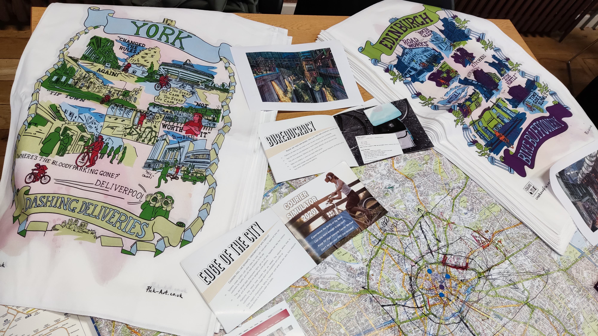

This is part of a collaboration with Oliver Bates and others on lived experiences of gig workers in British cities, but also on creative ways to share research outputs and "unmapping" as critical practice.

> Summary from [crankandfile.co.uk](https://crankandfile.co.uk/critical-tea-towels)

What do couriers experience when collecting and delivering orders? Are people thinking about the gig worker perspective when designing cities, policies, apps and platforms?

Inspired by our favourite radical tea towels, union banners, and worker’s rights movements as well as tea towels depicting tourist destinations the Critical Tea Towels explore what cities look like when we emphasise the experiences and views of the worker.

Maps (and tea towels) are designed to emphasise a particular perspectives, viewpoints, or actions that a viewer should take. This can often mean that certain levels of detail are missing from a tourist maps, which emphasise the most touristic venues. As a tool for communicating values, the style of tea towel art provides an interesting opportunity for subversion, allowing us to foreground the hidden geographies of our cities.

To build these, we used data and concepts gathered and synthesised by Oliver Bates, Ben Kirman, and Carolynne Lord as part of the [Switch-Gig](/projects/switch-gig) and [FlipGig](https://www.flipgig.org) research projects. Our data was gathered through co-design workshops and interviews with gig workers. These research projects both looked to bring out the voices and experiences of workers who are treated as invisible infrastructure in the day-to-day lives of many.

From our research we selected a number of key messages and anecdotes, drawing out a range of courier experiences. We worked closely with an illustrator to iterate the look and feel of the experiences. This makes sure they both represent real places in these cities, but also real experiences of gig workers in these spaces. For example, most tea towels of York focus on the historic architecture of the city, where our tea towel foregrounds the bike racks and car parks, and what they mean to the people who live and work there.

We had the tea towels professionally printed, and handed them out as part of an event on the future of gig working at the [People's History Museum](https://phm.org.uk/) in Manchester. 

More of these unusual research outputs at [Crank and File](crankandfile.co.uk), see also the sister project [Meal Deal](/projects/meal-deal), a card game about the experiences of gig-working couriers.

The illustrations are by [Tony Pickering](https://pick-art.co.uk). 
This project was funded by the [UKRI "Telling Tales of Engagement" scheme](https://www.ukri.org/what-we-do/what-we-have-funded/epsrc/digital-economy-telling-tales-of-engagement-awards/) that supports projects with research impact.

