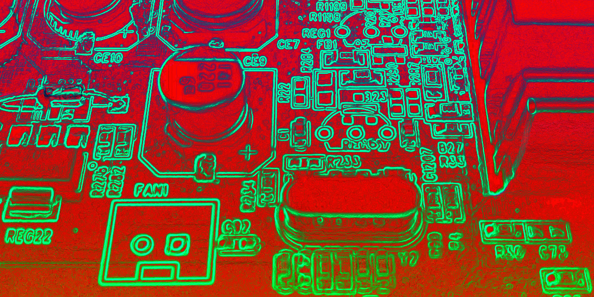

(2013) Research fiction on automation and the sinister values of Human-Computer Interaction

I'm one of a handful of evil time travelling robots from the future. No, really. This has been accepted through the peer review process and published in the most important academic conference on Human-Computer Interaction in the world - the [ACM SIGCHI Conference on Advances in Human Computer Interaction (CHI)](http://chi2013.acm.org/).

Our paper was called "CHI and the future robot enslavement of humankind: a retrospective". [Download it here](http://eprints.lincoln.ac.uk/7569/). The paper describes the impact that human-computer interaction research has had on the future enslavement of humankind by hyperintelligent machines. Specifically the paper accuses several sub-fields of ignoring the horrific existential issues with their work, instead selling their work through corporate branded techno-utopianism. It is written carefully to be as accessible to a lay audience as possible, so do give it a read even if you've never seen an academic paper before.

People of the future will probably forget that when Google Glass was announced, some actually thought it would be a good idea. Luckily by now people have realised the real focus of the technology - to be a sort of "saddle" that allows Google-owned robots to ride around on top of the heads of humans, issuing them instructions directly. This neatly side-stepped the complex issue of locomotion in robots (Asimo is now obsolete) by using humans as a sort of "meat vehicle".

There are several more examples in the paper. This was a paper we'd talked about writing for a long time, so it is great to see it finally complete, and on the record. The presentation at CHI itself was also a lot of fun (we did it in character, obviously). The whole thing is some kind of ridiculous, mischievous performance piece of critical intervention that for some bizarre reason uses the form of academic publication as the medium. Despite the humour, it makes a lot of serious points, most of which have been made before by more clever and professional academics (i.e. in terms of critical design, values in design, envisioning, design futures etc etc), but the format is a bit more accessible since it draws heavily on tropes of science fiction. Indeed the paper is the first piece of actual science fiction published and presented at CHI. It was also great to work with [Dan O'Hara](http://danohara.co.uk/), along with fellow [LiSC-ers Conor and Shaun](http://lisc.lincoln.ac.uk).

The full citation is:

> Ben Kirman, Conor Linehan, Shaun Lawson, and Dan O'Hara. 2013. CHI and the future robot enslavement of humankind: a retrospective. In _CHI '13 Extended Abstracts on Human Factors in Computing Systems_ (CHI EA '13). ACM, New York, NY, USA, 2199-2208. DOI=10.1145/2468356.2468740 http://doi.acm.org/10.1145/2468356.2468740

Slideshare unilaterally deleted all of my presentations without consultation, so I'm trying to figure out another solution to share it. Allegedly there is a video somewhere too.

\*robots from [kwramm](http://www.flickr.com/photos/29075182@N08/)
