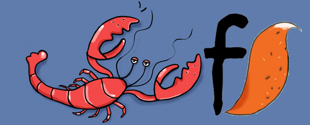
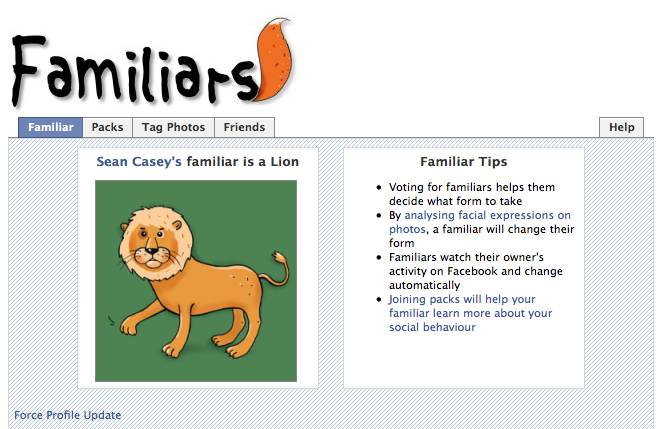
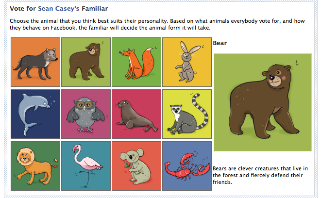

(2009) Analysing social network data to determine animal personality

Familiars 2 is based around the concept of each player owning a companion animal - a virtual sprite or creature similar in concept to Pullmans dæmons, which take an animal form that represents the personality of the owner. The pattern of a players interactions and behaviour in the social network of the game and Facebook itself is used to directly decide what animal form a player’s familiar should take. For example, a player who has many friends and is very active in the social environment of Facebook, the familiar may choose to take the form of a highly social animal (e.g. a rabbit) to reflect this aspect of their personality. Similarly a relatively less socially active player’s familiar may choose to be a solitary creature such as a Bear.

Familiars can be considered a self-presentation tool. The key difference is that the player has very little direct impact on the form the familiar will choose, since analysing the actual behaviour of the owner makes this decision. For example, allowed to define their own identity, players may choose to represent themselves as highly social. However, in Familiars 2, by analysing the observed social activity of the player (with permission), this may not prove to be an accurate representation. The application was developed on the “Facebook Developers Platform” and made available to all Facebook users to install on their profile. By agreeing to install the application, a small box would appear on their profile page showing the current animal form of the familiar and a link to show more details. Within the application itself, users can see the current familiar (and the reasons why it has chosen this form), the social status of any groups the player is a part of, and may also suggest the familiar runs facial expression recognition on specific photographs in order to learn more about their owner.

Ben Kirman, Eva Ferrari, Shaun Lawson, Jonathan Freeman, Jane Lessiter and Conor Linehan (2009) _Familiars: Representing Facebook Users’ Social Behaviour through a Reflective Playful Experience_, Proceedings of Advances in Computer Entertainment 2009, ACM Press, Athens. ([pdf](http://eprints.lincoln.ac.uk/2169/1/familiars_ACE2009-cameraready.pdf))
