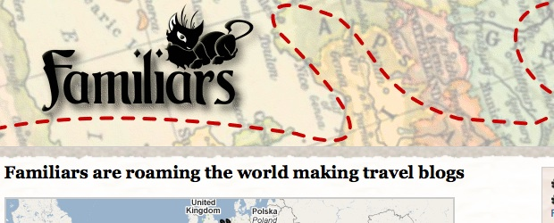
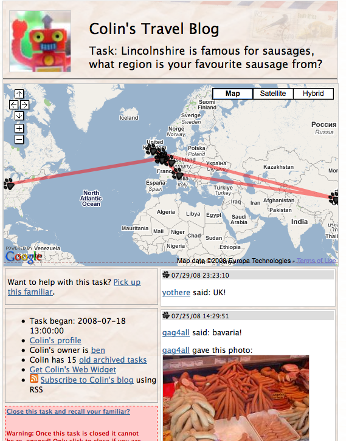
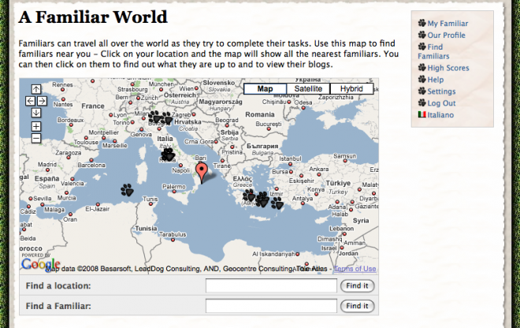

(2007) Social game about creatures who travel the world meeting new people

Familiars are virtual creatures that inhabit the real world. They can be though of as a virtual companion (like a witch’s cat), pet, or dæmon. A familiar has a life independent of its owner and are free to travel around the world, collecting photos and information that they document in their blog. When registering, a player gets to adopt and customise their own familiar. They then manually define a task for the familiar to complete and release it in a location of their choice. Once released, other players can interact with familiars and contribute items to their blog, by using the web or mobile client.

As the player and their familiar explore the world meeting others, a social network is built to show who they have met and interacted with in the game. Players can compare their network with other people and see how they rank in the social high scores. Depending on the shape and size of each player’s local social network, they are assigned a score. In order to rise in the rankings players must learn how to create tasks for their familiar that are attractive to other players, and maintain existing relationships through continued interaction. The scores are weighted so that players with medium sized social networks with relationships that are well maintained will score higher than players with large networks of remote friends with whom they rarely interact.

## Publications

Ben Kirman, Shaun Lawson and Conor Linehan (2009) _Mario, Luigi and Dave: The Effect of Language on the Social Structure of a Bilingual Online Mobile Game._ Proceedings of MindTrek 2009, Tampere, Finland, 30th September – 2nd October 2009. ([pdf](http://eprints.lincoln.ac.uk/2170/1/MarioLuigi_postprint.pdf))

Ben Kirman, Shaun Lawson and Conor Linehan (2009) _Gaming on and off the Social Graph: The Social Structure of Facebook Games_, Proceedings of the International Conference in Social Computing, Vancouver (IEEE). ([pdf](http://eprints.lincoln.ac.uk/2168/1/paper319.pdf))

Ben Kirman and Shaun Lawson (2009) _Hardcore Classification: Identifying Play Styles in Social Games using Network Analysis_, Proceedings of International Conference in Entertainment Computing, Paris (Springer Lecture Notes in Computing Science) ([pdf](http://eprints.lincoln.ac.uk/2178/1/hardcore_classification-postprint.pdf))

Ben Kirman, Sean Casey, Shaun Lawson and Duncan Rowland (2008)_User Powered Games for Research_, Proceedings of the Games Design and Technology Workshop and Conference (GDTW) 2008, Liverpool. ([pdf](http://eprints.lincoln.ac.uk/2173/1/User_powered_games_(camera_ready).pdf))

Ben Kirman, Shaun Lawson, Duncan Rowland, Fabrizio Davide, Francesco Collovà and Stefano Puglia (2008) _Familiars – Manipulating Social Networks with Mobile Gaming_, Proceedings of the Games Design and Technology Workshop and Conference (GDTW) 2008, Liverpool. ([pdf](http://eprints.lincoln.ac.uk/2172/1/Manipulating_Social_Networks_(camera_ready).pdf))

Ben Kirman and Duncan Rowland (2006) _Familiars: Social Gaming with PASION_, Proceedings of the 4th International Games Design and Technology Workshop, Liverpool, 15-16 November 2006. ([pdf](http://eprints.lincoln.ac.uk/2176/1/FamiliarsGDTW2006Revised.pdf))
