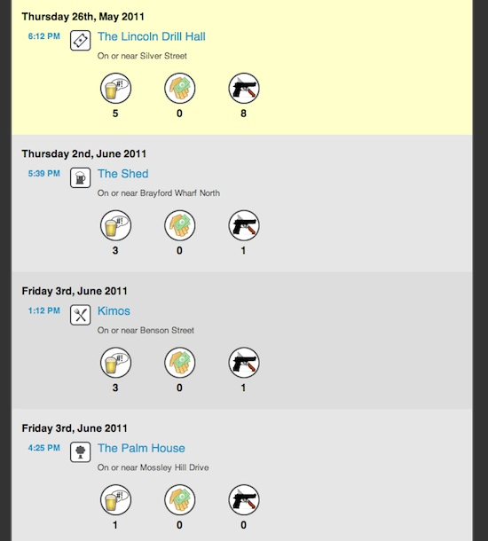

FearSquare is a site which connects your Foursquare checkin history to the Police UK crime database to get an accurate picture of crime levels in your daily life. It was developed by Andy Garbett and a group of us from LiSC as a critical application that shows a different view of crime statistics.

Most applications of crime stats have negative implications, and showing raw crime data to people is naturally unnerving, can feed into negative perceptions and prejudices based on the implied "safety" of real and complex places. We wanted to explore a more provocative and reflective application of crime data (hence the scary theme) to point out the wide difference between the perception of crime based on data and actual lived experience in those places.

There are high score tables on the site that show the most "dangerous" places in the UK, and users are challenged to gain more points by visiting real world locations that have high levels of crime. By visiting these locations the users are forced to reflect on the meaning of crime statistics and challenge preconceptions about areas they may avoid. In the UK, most places are remarkably safe with common sense, and the pure statistics about crime imply something different from reality. For example, that a high street sees lots of theft should not be a surprise, since that is where the shops are, so are the shoplifters. Anti-social behaviour is often seen at places with big night life scenes, yet 3am on Bold Street in Liverpool is very different from 11am.

Fearsquare is compelling as it leans on the implied danger of crime statistics, and the difference between data about a place, and the place itself. As such we've written quite a bit about it over the years:

* Ben Kirman, Conor Linehan and Shaun Lawson (2018) [Reorienting Geolocation Data through Mischievous Design](/papers/Kirman2018GeolocationFunology.pdf). In Mark Blythe and Andrew Monk (Eds) Funology 2: From Usability to Enjoyment. Springer.
* Andrew Garbett, Jamie K. Wardman, Ben Kirman, Conor Linehan, and Shaun Lawson (2014) [Fearsquare: hacking open crime data to critique, jam and subvert the 'aesthetic of danger](/papers/Garbett2014Fearsquare.pdf). In Proceedings of HCI Korea, Seoul, Republic of Korea
* Andrew Garbett, Conor Linehan, Ben Kirman, Jamie Wardman, and Shaun Lawson (2012) [How dangerous is your life? Personalising Government open crime data](/papers/Garbett2012Fearsquare.pdf). In Proceedings of Workshop on Personal Informatics. ACM SIGCHI Conference on Human Factors in Computer Systems. Austin, Texas, USA.
* Andrew Garbett, Conor Linehan, Ben Kirman, Jamie Wardman and Shaun Lawson (2011) [Using social media to drive public engagement with open data](/papers/Garbett2011Fearsquare.pdf). In Proceedings of Digital Engagement Conference 2011. Newcastle, UK.
