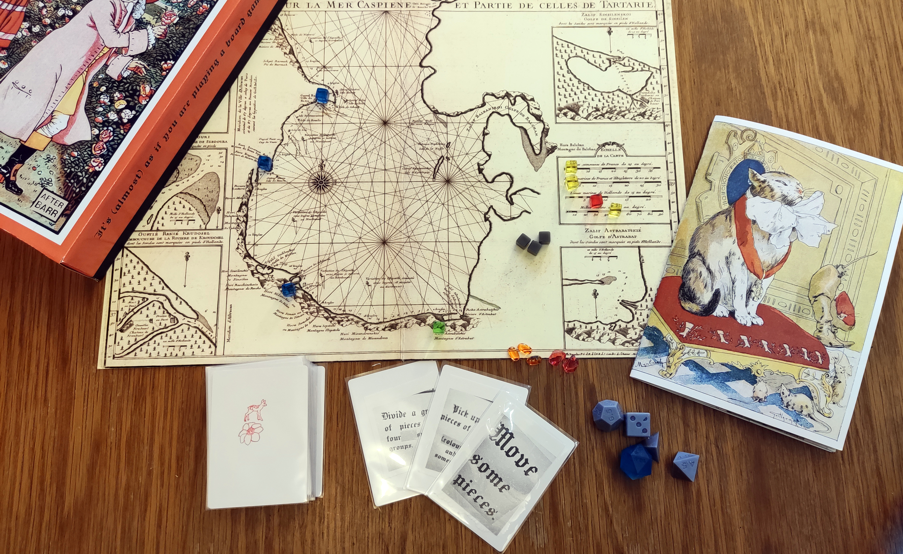
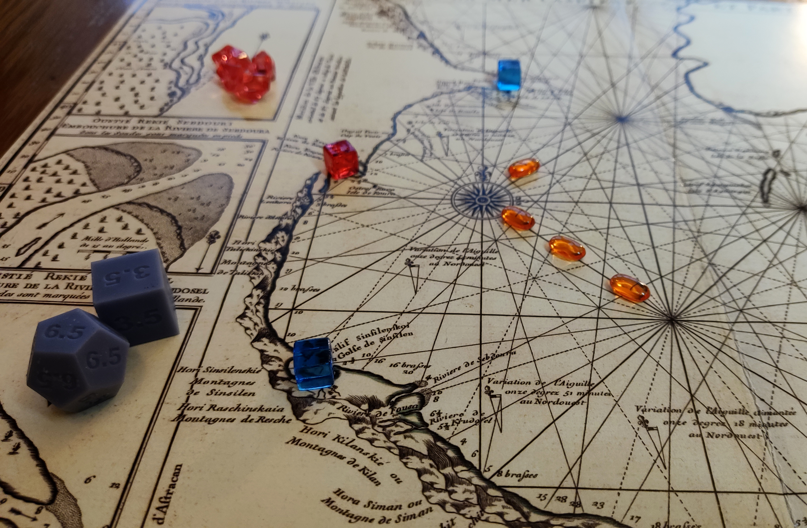
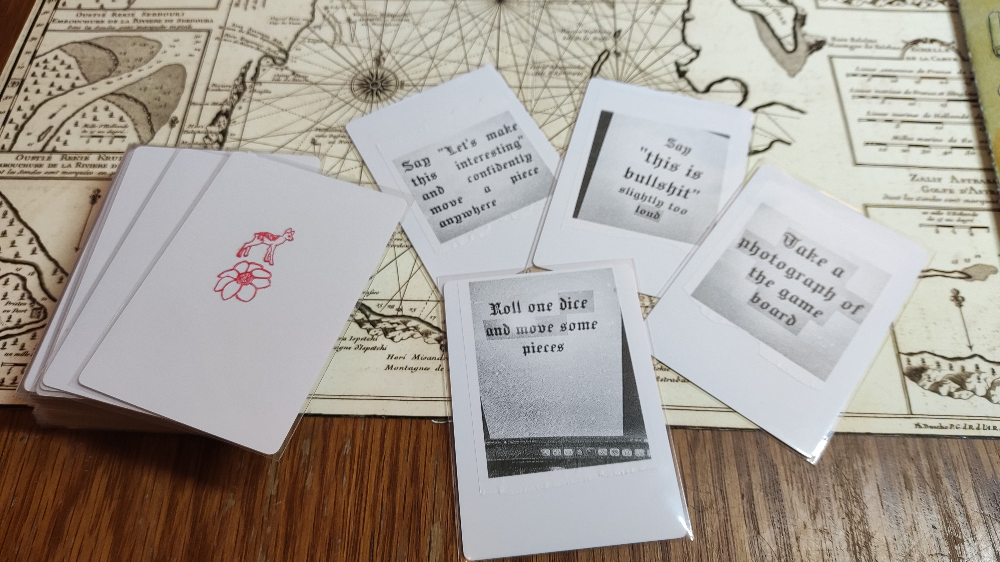
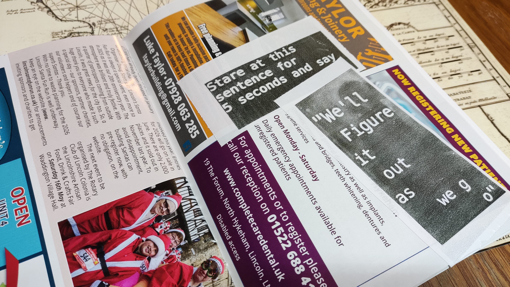

Your opponent frowns as you move the cube triumphantly across the board. Maybe the frown means something, maybe the cube or the board mean things too. It certainly looks like they do. [It's (almost) as if you are playing a board game](https://boardgamegeek.com/boardgame/465753/its-almost-as-if-you-are-playing-a-board-game).

This is a game about the "bits" in games, about collectively summoning worlds and operating them together around a table. It's about feeling the absurdity of moving bits of shiny plastic and wood in very precise and intricate ways on a slab of cardboard. It's about textures, it's about symbols and signs, it's about being an alien touching wood for the first time, and it's about how we play with each other.

IAAIYAPABG is an attempt to capture some of this dance, and give a moment to be present and undistracted by the systems and fictions, and think about the performance of playing board games.

It's also quite daft, and that's ok too.

In IAAIYAPABG the players sit around a table and use the material to perform playing a board game. The instruction booklet gives some idea of how to get going, and the cards share actions that can be performed, that affect the game state. The board and the pieces certainly are familiar, and between all this you can put on a convincing display. That masterplay of tactical genius, the celebrated victory and sour defeat are all easily within reach, and without the mental strain and complexity that is expected in other games.

You can make your own copy of IAAIYAPABG by following the instruction guidebook. Alternatively you can have a similar effect by swapping all the game rulebooks randomly around your collection.

## Context

The inspiration for this game comes from [Pippin Barr's "It is as if..." series of games](https://pippinbarr.com/ideas/it-is-as-if/). They are funny, fun and smart at once (games and person), which is an annoying combination and quite rude really. At A MAZE 2025, [Devolution hosted Pippin at an exhibition of these games](https://devolution.online/itisasifyouwere/), where you could play different intermediate versions of each. Pippin and [Csongor](http://www.csongorb.com/) also gamely participated in a spontaneous game of "It is as if you are at a book signing", around [these lovely printed booklets from the exhibition](https://github.com/csongorb/growingstuff/tree/main/booklets).

Anyway, not only are these games interesting themselves, but are case studies in an approach called "Method for Design Materialization" (MDM) from Rilla Khaled and Pippin. MDM is about using version control to capture insight within a design process, especially in making computer games. It is part of a growing collection of tools related to [Research through Design](https://www.interaction-design.org/literature/book/the-encyclopedia-of-human-computer-interaction-2nd-ed/research-through-design), we might call "thinking by making". I've been working in and around this space for a while (making weird things because we learn stuff when we do) and it's a relief to see a growing acceptance of making as a way of contributing. Inspired also by Pippin's [excellent book](https://mitpress.mit.edu/9780262546119/the-stuff-games-are-made-of/), I wanted to give MDM "a go". So, since board games seemed AT THE TIME like an easy topic that Pippin hadn't done yet, I ripped-off/homaged/imitated the process to see if MDM works for me, and how I make things, and think about making.

It mostly did - but I struggled because a) Board games don't use source control enough it turns out??? b) I found it difficult to think in public, like Pippin does so well, without it turning into _writing_, a very different activity for me. BUT I did find lots of insights, it was generative and instructive, and I got stuff out of it. In this respect IAAIYAPABG represents industrial waste, a byproduct of this process. 

I might (should probably) share what I learned, at some point (some pointers in the readings), but for now enjoy the offal:
- [The source repository for the game and documents.](https://github.com/bkirman/its-almost-as-if-you-are-playing-a-board-game)
- [The unedited journal](https://github.com/bkirman/its-almost-as-if-you-are-playing-a-board-game/blob/main/journal.md)

## Further Reading
- Rilla Khaled, Pippin Barr (2023) [Generative Logics and Conceptual Clicks: A Case Study of the Method for Design Materialization](https://doi.org/10.1162/desi_a_00706). Design Issues 39 (1): 55–69.
- Pippin Barr (2023) [The Stuff Games Are Made Of](), MIT Press
- Jay Dragon (2025) The Expressionist Games Manifesto, online: [https://possumcreek.medium.com/the-expressionist-games-manifesto-122d8afd1fe2](https://possumcreek.medium.com/the-expressionist-games-manifesto-122d8afd1fe2)
- Amabel Holland (2025) [Cardboard Ghosts](https://www.taylorfrancis.com/books/mono/10.1201/9781003500834/cardboard-ghosts-amabel-holland), CRC Press
- Super Eyepatch Wolf (2026) [The Bizarre World of Fake Videogames](https://hollow-press.net/products/the-bizarre-world-of-fake-video-games-by-super-eyepatch-wolf-u-d-w-f-g-essays-i), Hollow Press
- [IAAIYAPABG on BoardGameGeek](https://boardgamegeek.com/boardgame/465753/its-almost-as-if-you-are-playing-a-board-game).
- Oliver Bates and Ben Kirman (2025) [Making a Meal out of a Mountain](/papers/Bates2025MealMountain.pdf), Presented at British DiGRA 2025.
- [Rules for Mornington Crescent (Simplified)](http://www.isihac.co.uk/games/gamesm.html#morningtoncrescent)
- [It's as if you are organising an academic conference?](/projects/fictional-conference/)