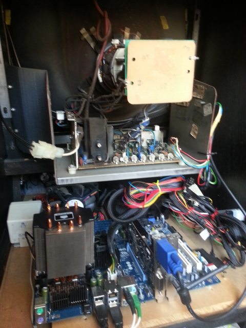
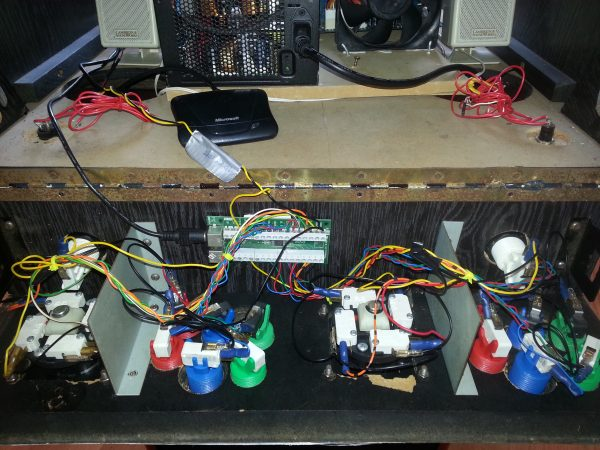
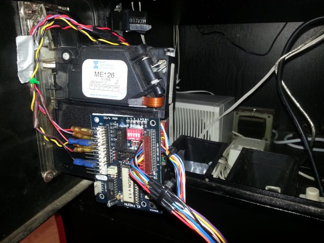
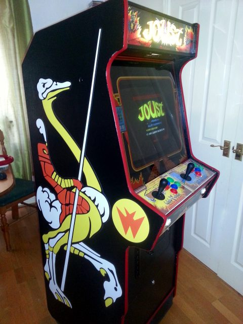

In 2006 I left the real world and took a big pay cut to become an academic. As part of that, I made myself a promise that should I ever finish my PhD, I would buy and refurbish a 1980's arcade cabinet. That old dream has been weighing on my mind and finally this year I made good on that promise.

Although not strictly related to my research, it was an interesting and challenging project and I found it very rewarding - it made me reflect on what design means to me. In particular, I engaged with a long struggle with myself over how to find compromise between authenticity of restoration and functionality as a machine to be used. For example, in identifying the cabinet itself. This kind of construction is not complex in a woodworking sense - you can easily find plans for cabinets online, and you can even buy [flat-pack kits that contain all the wood you need to construct the cabinet](http://www.arcadeworlduk.com/products/Flat-Pack-Upright-Arcade-Cabinet-Kit.html). It is just a funny shaped box, but it was critically important to me that my box was an actual arcade machine in the late 80's, from the same time I was in those arcades having those experiences that had such lasting impact on my life. It was important that the chipboard itself was imbued with the original magic. This is the same feeling that meant I was horrified when a curator from Museum of Modern Art did [an exhibition on games](http://www.moma.org/explore/inside_out/2012/11/29/video-games-14-in-the-collection-for-starters/) but did not show games on the correct hardware. For me, perhaps paradoxically, the physicality of digital games and the context of play are vital aspects of the experience. Games are art but it is a disservice to put them in white-roomed galleries.

By that same token, games are meant to be played. In my project I was torn between the choice to refurbish a single game correctly, or to compromise that purity in favour of a system that could run multiple games and thereby ensure the cabinet sees more **play**. I decided on the latter - but drove for authenticity in other aspects.

Tasks included:

- Finding the cabinet - via online auction from someone's garage. Based on maintenance markings I think the cabinet was originally in an arcade in the seaside town of [Cleethorpes](http://wikitravel.org/en/Cleethorpes).
- Paint stripping, wood restoration, cleaning and repainting of the woodwork. (and chipping off 3 decades of dried chewing gum...)
- Rewiring the original 25 year old 15Khz monitor so it could connect to a VGA output (watching lots of [videos like this](https://www.youtube.com/watch?v=K4Nhujs5Wg4)). Obviously I could not allow myself to have a modern flat screen.
- Sourcing a [video card capable of displaying non-standard resolutions](http://www.ultimarc.com/avgafaq.html) used in arcades.
- Building a control panel to authentic [standard arcade layout](http://slagcoin.com/joystick/layout.html), then wiring up microswitches and joysticks to a modified [USB keyboard control board](http://i380.photobucket.com/albums/oo244/mlwood2008/ipac2_top1.jpg).
- Building a small PC to sit inside the cabinet and run the software.
- Bringing all the software together to work based on joystick input (actually coded as keypresses). I used [HyperSpin](http://www.hyperspin-fe.com/) but would not recommend it to others, it is very difficult to set up.
- Sourcing the original arcade artwork, including control panel, marquee, bezel and side art. Vectorising and modifying to fit the cabinet profile and getting it professionally printed on vinyl and acetate.
- Finally - rewiring the original coin mechanism to accept coins and issue the correct number of credits based on denomination (again by faking keypresses via a USB keyboard controller). This was difficult - UK coins have changed a lot, and our mechanisms were electronic, not mechanical like many US ones.

<figure>

<figcaption>A look at the back of the CRT and the new PC underneath</figcaption>
</figure>

<figure>

<figcaption>Underneath the control panel, exposing the wiring from the front. The Microsoft dongle is for a wireless keyboard and mouse (for maintenance)</figcaption>
</figure>

<figure>

<figcaption>A look behind the coin door at the coin acceptor mechanism. Accepted coins drop into a bucket. Note the meter at the top of the image.</figcaption>
</figure>

I found that I got a lot out of this project. Not just the activity of bringing something back to life, but also to use such a wide range of skills (woodworking, electronics, programming and graphic design) picked up over the years together on a single project. I found it rewarding to connect with the past in this way and finish the project to a standard I'm happy with. Also, the journey was enlightening as a series of esoteric problems with no single solution. A warm memory is of contacting a retired chap here in the UK who used to solder control boards for coin mechanisms in his garage in the early 90's. He very kindly dug out the long forgotten circuit diagram from a filing cabinet he keeps, and scanned it in for me.

These are not original thoughts by a long stretch. Millions of people engage in restoration projects to bring to life old cars, motorbikes, furniture and a thousand other things. There is something very powerful about the feeling you get doing something difficult that is positive, rescuing a beautiful object from obliteration, and most of all doing it right. Also, I am now accidentally an expert on late 80's UK coin alloy compositions.

<figure>

<figcaption>The finished cabinet, with vinyl artwork. Not quite correct for Joust but near enough for me.</figcaption>
</figure>

###### \*[CRT image from Jessie Hirsch](https://www.flickr.com/photos/jhirsch/2162615145/)
