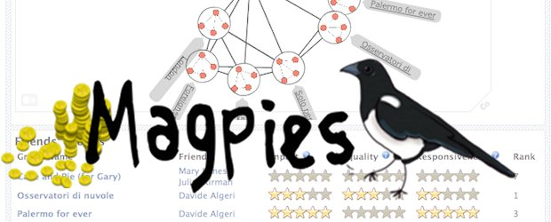
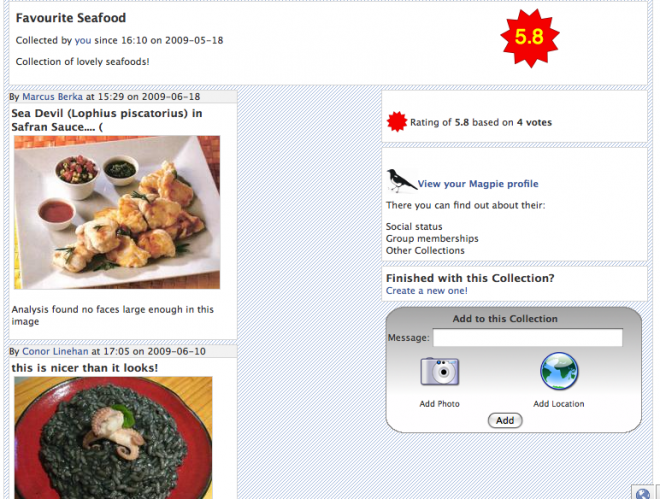

(2009) A game about collecting trinkets and building social networks

Magpies is a game of collection. In many cultures, Magpies are birds associated with the activity of collecting small shiny trinkets with which they decorate their nests. Players in the game work individually and create collections or stashes around a theme determined through free text entry. Other players are invited to contribute items that match the theme, in the form of text, images and/or locations. The stash then builds up over time as a list of curiosities that match this theme. Players can rate one another’s stashes and compete to build the most popular collections. Players are also able to create and join arbitrary groups within the system. Groups are ranked against each other based on the status of the players within, to add a socially competitive angle to an otherwise individually driven game. Magpies was tested internally through a series of usability evaluations and focus groups in order to fine tune the game design and interface, before being released officially on the Facebook platform and being made open to the public.

In Magpies, as an addition to the main game, users were exposed to a variety of measures based on a selection of standard Social Network Analysis (SNA) indices. These were split into group and individual indices. The Group Indices included Group Cen- tralisation, Group Reciprocity and Group Density. The Individual Indices included Degree Centrality, In-Degree Centrality, Out-Degree Centrality and Reciprocity. By showing these measures to some players and not others, we built up a picture of how social feedback effects engagement in social games.

Magpies was developed as part of the PASION project (Psychologically Augmented Social Interaction Over Networks), a major European project involving 17 partner organisations from all over europe, funded through the EU FP6 scheme.

Ben Kirman, Shaun Lawson, Conor Linehan, Francesco Martino, Luciano Gamberini & Andrea Gaggioli (2010) _Improving Social Game Engagement on Facebook through Enhanced Socio-Contextual Information_, Proceedings of ACM Conference on Human Factors (CHI), April 10-15 2010, Atlanta, ACM Press (**Nominated for Best Paper/Honourable Mention**) ([pdf](http://eprints.lincoln.ac.uk/2166/))
