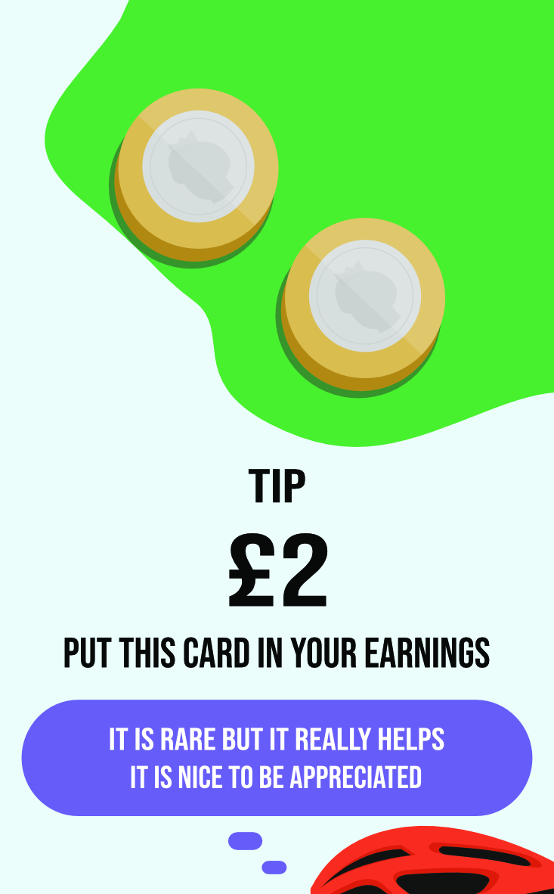
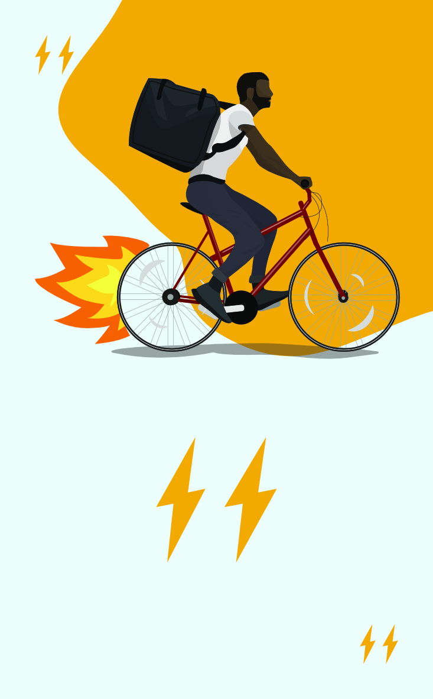
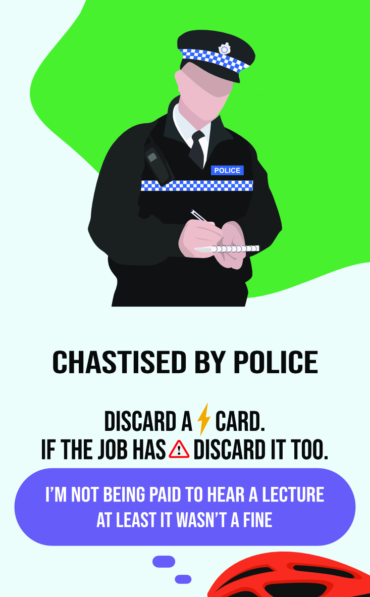

> What does it look and feel like to be in the saddle, with a bag full of hot food on your back, as your traverse city high-rises looking for the address of customer? What is the financial impact of waiting around all day for work that never comes? Is it worth pushing your luck and taking a risk if it makes the difference in wages?

> The lived experiences of cycle couriers are often invisible to consumers. Their needs can sidelined by app developers who focus on the customer experience rather than that of the worker.

Meal Deal is a game that puts players in the saddles of cycle couriers working in the gig economy. With a finite amount of stamina on tap each day, the cards allow players to weave their own gig economy story expanding on research with couriers who’ve worked in Manchester, York and Edinburgh in the UK as part of the [Switch-Gig](/projects/switch-gig) and [FlipGig](https://www.flipgig.org) research projects.

This is a part of Oliver and my collection of creative critical projects that have come from our work into social justice in the Gig economy. The artefacts are collected together as ["Crank & File"](https://crankandfile.co.uk). It has been fantastic to make things that explore the insights from research in different ways, rather than just reports and white papers. For the gig-economy in particular, games are a great way to explore the nature of the work and the challenges and joys riders experience. It is very much an example of a "system", dictated by algorithms and apps that create emergent issues around this kind of work, and this can be represented quite well in terms of a game loop. Players are forced into making the same kinds of decisions that couriers need to make in their work. For example - cutting down a one way street might be risky if you are stopped, but can also save enough time to bring your wage above poverty levels. This can give insight and a different perspective on a job that most of us only encounter as customers.

<!--img src="images/cardexample6.jpg" alt="Meal Deal card example - a job that costs 3 energy to earn £6" width="200"> 

You can read more about the game and download the cards and rules from [the official website](https://crankandfile.co.uk/meal-deal). There are a limited number of physical copies available.

The illustrations are by [Emily Martin](https://emilymartin.uk) and [Tony Pickering](https://pick-art.co.uk). The game design is by Oliver Bates and [Ben Kirman](https://ben.kirman.org).
Meal Deal is funded by the [UKRI "Telling Tales of Engagement" scheme](https://www.ukri.org/what-we-do/what-we-have-funded/epsrc/digital-economy-telling-tales-of-engagement-awards/) that supports projects with research impact.

