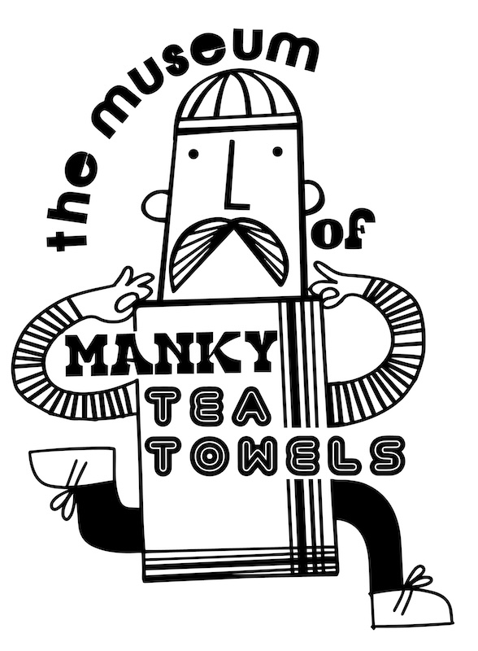
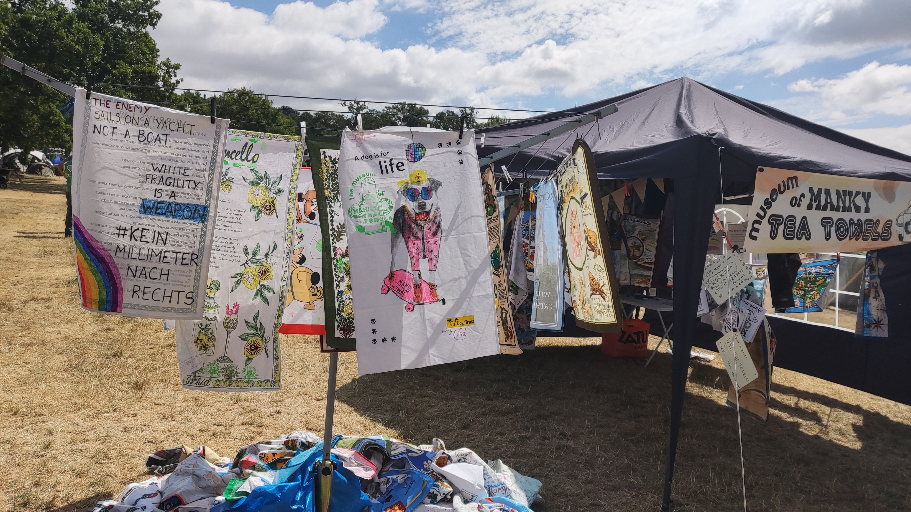
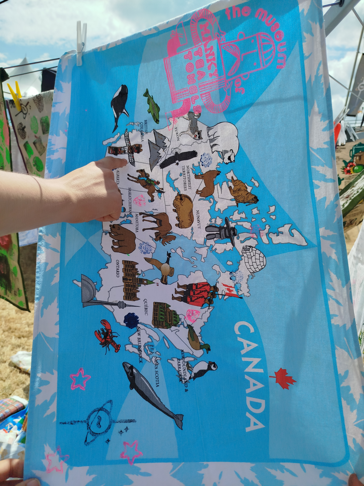
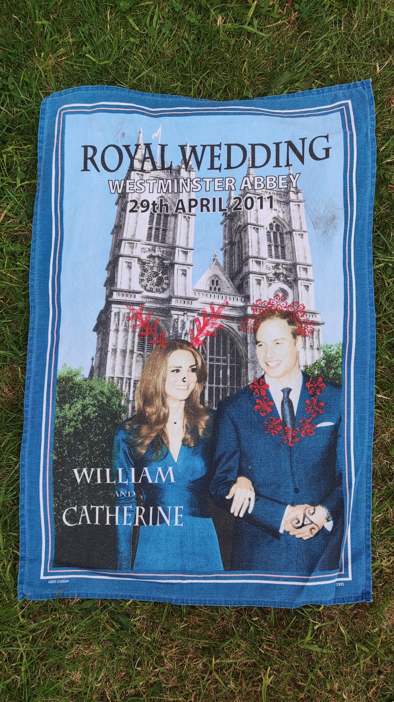
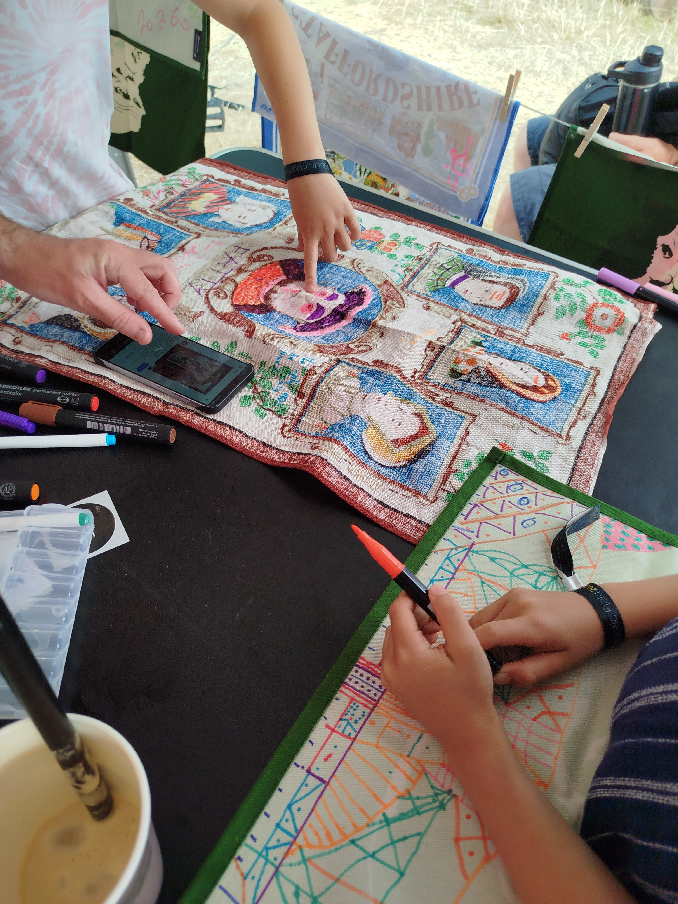
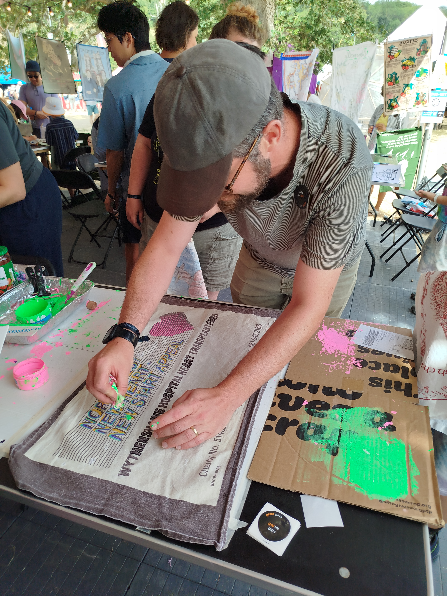
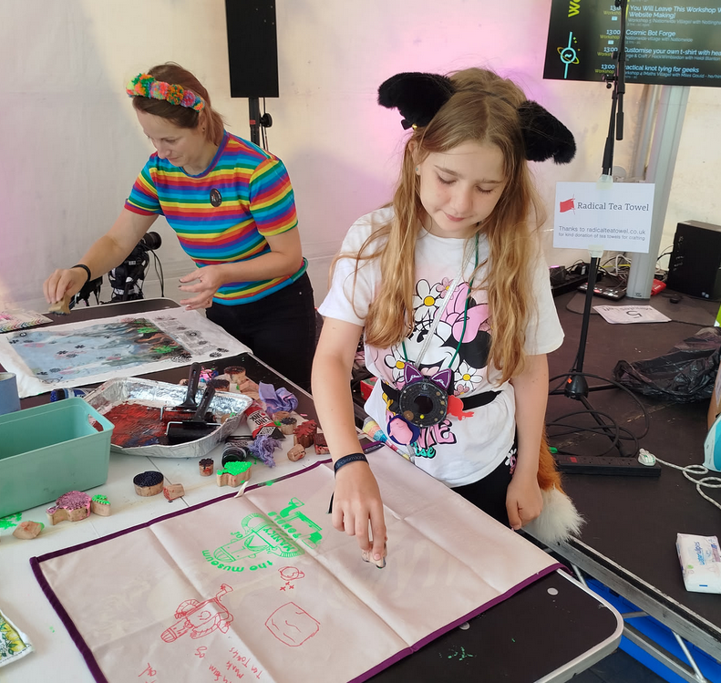
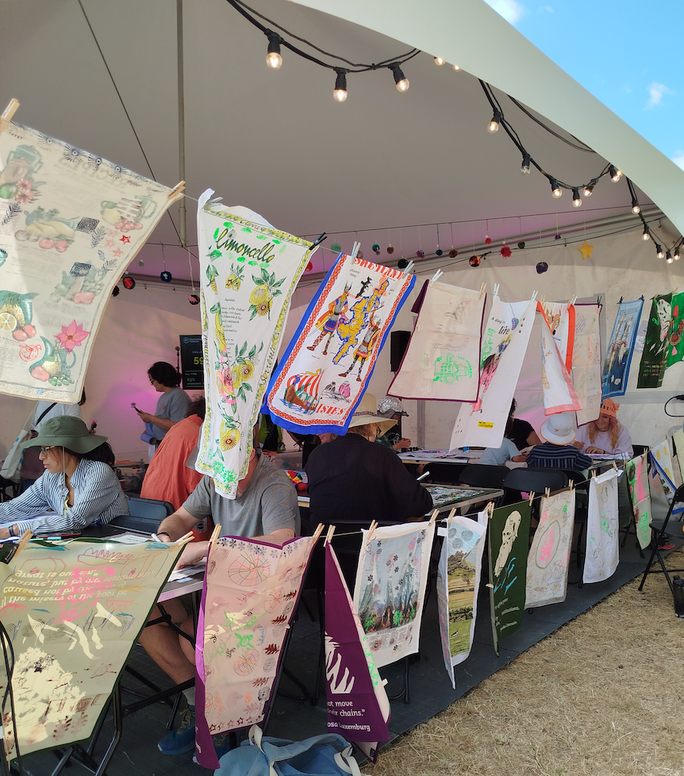

> Marvel at our collection of manky tea towels. We have been saving tea towels across the country from behind radiators, the backs of drawers, corners of charity shops, and boxes in lofts.

> Tea towels tell stories about the places we have been, the people we love, and the tea that we have drunk. They contain politics and history - they are designed as a lens on places and people, that we see and use every day. They carry traces of our imperfect washing skills, scorches from use as makeshift oven mitts, and the odd bit of cat sick.

> Fundamentally, tea towels are the real legacy of civilisation. At the end of history only manky tea towels will remain. We tell our stories by the stains we leave behind.

> The Museum of Manky Tea Towels celebrates the utility and absurdity of tea towels. It is an interactive, open exhibit that will be available for everyone during the festival. It features a collection of hundreds of tea towels from around the world to explore. You may use the museum towels to dry your mugs, or you can take, modify and enhance a tea towel to tell a new story.

## Background
As part of our research with gig-working food delivery couriers, [Oliver Bates](https://oliverbates.co.uk) and I produced a few unusual outputs, including a [card game](/projects/meal-deal), a [booklet of speculative designs](/projects/switch-gig), and a collection of [critical tea towels](/projects/critical-tea-towels). These were all great, and a way to share insights from our research in different (i.e. not academic paper) ways. We had a bunch of each printed, and it was always fun to share. The tea towels were always particularly well received - people *loved* them. 

I love them too, because there is something interesting in how tea towels tell stories about places. Our critical tea towels offer a specific perspective on the cities, showing car parks and tram lines instead of cathedrals and gardens. This subversion works really well, and helps make problems of other tea towels and change the way we look at them.

We really wanted to do more with tea towels, that wasn't just writing a paper. We were encouraged to submit a talk or workshop or installation to [Electromagnetic Field](https://emfcamp.org), and from there a silly idea got way out of hand in the best kind of way...

## The Museum
The Museum of Manky Tea Towels is a physical interactive exhibition of tea towels in various states of decay. Visitors are invited to use the tea towels to dry their washing, or to clean up spills, or to use as patches to repair clothes, or as makeshift hats. The museum also accepts donations of tea towels people bring along to share. It currently features around 200 tea towels from around the world, from souvenirs of places, through to freebies and collectables from companies and charities.

The museum starts as a disorganised collection around the space, with tea towels hung with pegs along zig-zagging washing lines, but visitors are asked to find order by guest curating sub collections. Making some space on the washing lines and using white boards to give notes. For example a collection of dogs, of horrible recipes, of calendars from the 80's, etc. 

We encouraged people to modify and edit the tea towels, especially to change the stories that the tea towels were presenting. For example, adding a scene from their own memories to that landscape, or just putting sunglasses on every animal in Canada.

There is a bit more detail and calls for action on the museum at the official website: [manky.website](https://manky.website)

We also have an [official zine](https://oliverbates.itch.io/manky) with more words and thoughts.

## The Workshop
At EMF we held a drop-in workshop, with the support of EMF volunteers, at the arts tent in the festival. We had loads of fabric pens, inks, stamps, and a screen printing frame for the museum logo. Visitors picked towels off the line and worked with us to edit, change and improve. We also had some pasta sauce, instant coffee, soy sauce and other condiments for a more traditional approach to making a tea towel manky!

(photos shared with permission)

We were kindly supported by [the Radical Tea Towel company](https://radicalteatowel.co.uk), who generously sent us a box of stock to use as the raw material for the workshop. We really love their tea towels and ethos, and it was fantastic to share them and have people enhance and engage with the donations. Visitors noted the high quality of their tea towels compared to most of the collection!

## Next?
The museum is dormant for a moment while we think of what to do next, but it was a fantastic experience. [EMF](https://emfcamp.org) is a deeply wonderful and special festival, run by volunteers, featuring a wild array of creative and experimental work. It was really inspiring to be around thousands of diverse, curious, playful and inventive people, and was really a perfect fit for the museum. It joined hundreds of talks, exhibits and installations that always surprised and delighted - from lasers, projectors, flamethrowers, music, and robots, to games, old phone networks, and teletext artworks. A profoundly special event that was an utter joy to attend. I definitely encourage you to check the [EMF website](https://emfcamp.org) and [watch some of the recorded talks](https://media.ccc.de/c/emf2026).

Thanks to [Dot Rogers](https://www.instagram.com/dotrogersting/) for doing the logo illustration; Catherine, Jonathan, Rebecca from EMF and installations orga, along with all the EMF volunteers; and visitors that engaged with the museum in the spirit it was shared. Thanks to Radical Tea Towels for their support, and the various friends, family and members of the local community that donated tea towels to the collection.

