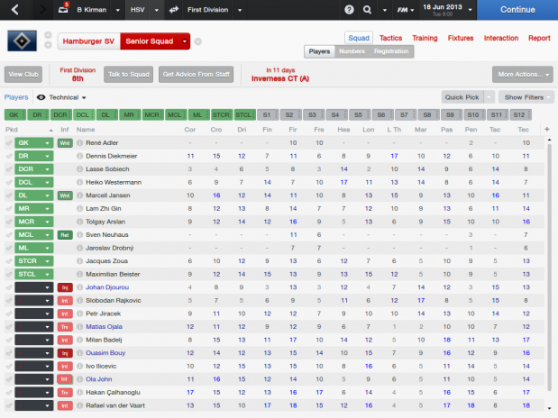
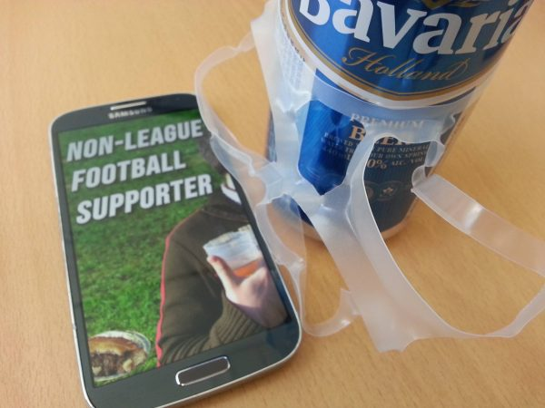
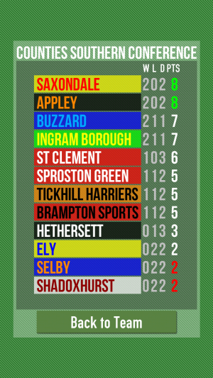

Along with Tom Feltwell and Conor Linehan, I'm very interested in how superstition may be embedded within game mechanics to make for unusual playful experiences. This has come from thinking about sports management games. We are avid fans of the [Football Manager](http://www.footballmanager.com/) games, where the player takes control of a professional football (soccer) team and organises matches, training, signing and tactics, but does not control the players themselves (e.g. as in [EA'S FIFA games](https://www.easports.com/fifa)).

Part of the appeal of the Football Manager series is the utter complexity of the simulation. Each player has dozens of attributes that determine both the raw skills and the mental state of the player. Psychology is key, and most of your decisions will have an emotional effect on the players. For example, some players ask to wear a certain number on their shirt. Allowing or disallowing this will affect that player, and potentially their performance in future matches, _somehow_. The genius of Football Manager's design is that you \*don't know\* the exact effect of the hundreds of small decisions you make as you play.

In this way, the game logic is somewhat immune to reverse engineering (a process known in Game Studies as "theorycrafting" ([Karlsen, 2011](http://www.digra.org/dl/db/11301.06109.pdf))), there is no optimally calculated perfect way to play. The impact of the player choices on the game is more holistic. Since there is so little feedback from the results of your actions, the player naturally forms superstitions based on theories developed through play. For example, if you notice that you tend to win games where you used the "team talk" to shout at your team, you quickly build patterns of behaviour based on this very loose evidence provided through indirect feedback rather than any real understanding of the underlying system.

This is particularly interesting because most guides to making effective design emphasise the importance of clear, timely and relevant feedback to the user. This is supposed to ensure the user feels in control and understands the effects of their actions. Football Manager does exactly the opposite and is brilliant for it.

With this in mind we wanted to build a game that focuses on this one particular aspect. If you take a step back from Football management, you have games like [Football Chairman](http://football-chairman.com/), a fantastic mobile game where you take on a higher-level role managing the manager. We took another step back - in Non-League Football Supporter you play a fan of a team who goes along to all matches. You have no direct control over the players or the team at all. Instead, the only decisions you make as a fan are: deciding what lucky clothing to wear, what drink to have and food to eat, and whether to bring your kids, or your dog, along to the match. Based on the results and events of the match, you are implicitly invited to develop unusual theories about the effects your decisions had on the match.

Android users can [download the game from Google Play](https://play.google.com/store/apps/details?id=uk.ac.lincoln.games.nlfs.android&hl=en) or directly from the [game website](http://non-league.football).

We presented our initial work on Non-League Football Supporter and the related game of celtic mysticism [Sacred Harvest](/projects/sacred-harvest/) at the DiGRA conference in May 2015:

* Ben Kirman, Tom Feltwell and Conor Linehan (2015) [Player superstition as a design resource](/papers/Kirman2015Superstition.pdf). In DiGRA Conference Extended Abstracts. Lüneburg, Germany
* Ben Kirman, Conor Linehan and Tom Feltwell (2022) [Inscrutable Games: How Players Respond to Illegible or Opaque Game Design](/papers/Kirman2022NLFS.pdf). In Proceedings of the International Academic Mindtrek Conference 2022. Tampere, Finland.
