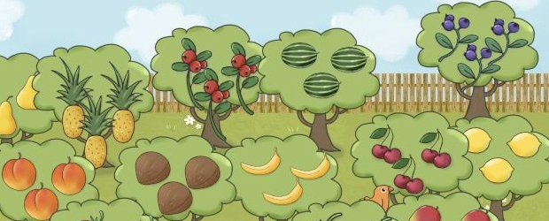
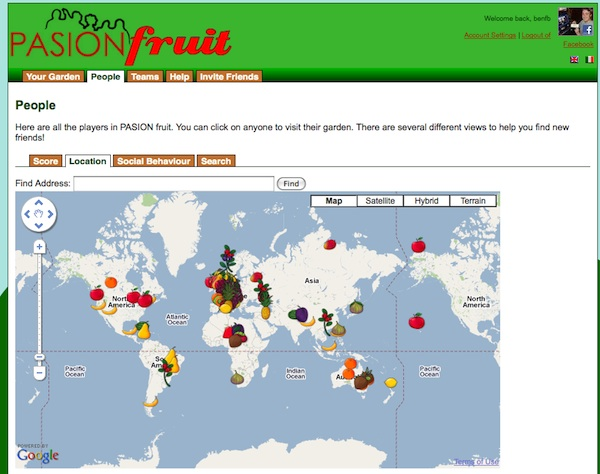
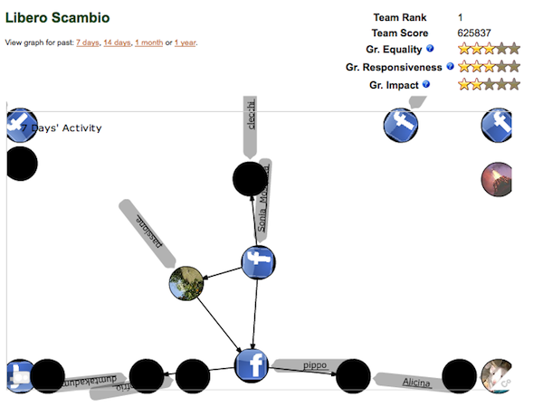

PASION Fruit is a social game about virtual fruit gardens. Each player, upon registering to play the game, is asked to choose a real location for his or her garden, which will be important when it comes to paying for transport costs to send fruit to other players.

The game is centred upon the concept of gifting. The objective of players is to collect a diverse variety of fruit, and the only way to gain new fruit is through gifts from fellow players. When registering to play the game, players are assigned one “native” type of fruit based on their home location. The types of fruit available differ based on country, so, for in-stance, while players in the UK may grow Apples, Pears and Strawberries, players in Italy will be capable of growing Lemons, Grapes and Olives. Over time, all fruit trees will generate fruit that can be sent to other players as gifts. When sending a fruit, a player must pay a negative cost in terms of CO2 emissions that are calculated as a function of distance it costs more points to send a fruit great distance than to local co-players. E.g. it will cost considerably more to send an exotic fruit to somewhere far away than it will to send a fruit to someone in a nearby location.

The formal goal of the game is to gain points based on the diversity of fruit types within your garden, however this is balanced against the environmental cost of transporting fruits long distances. Since each country only grows a certain subset of fruits natively, in order to be successful players are forced to transport more exotic fruit from other locations.

The research aim of the project was to understand more about directed social interactions in games. By seeing how players interacted, how gift networks emerged, the reciprocity of gifting, etc, we understand more about the kinds of social interactions prompted by strangers and friends on the platform. 

PASION Fruit was developed as part of the PASION project (Psychologically Augmented Social Interaction Over Networks), a major European project involving 17 partner organisations from all over europe, funded through the EU FP6 scheme.

The amazing illustrations for Pasion Fruit were created by [Aga Kowalska](https://www.instagram.com/agakowalskastudio_lincoln)

* Ben Kirman, Francesco Collovà, Fabrizio Davide, Eva Ferrari, Jonathan Freeman, Shaun Lawson, Conor Linehan, and Niklas Ravaja (2011) [Social architecture and the emergence of power laws in online social games](/papers/Kirman2011SocialArchitecture.pdf). In Proceedings of Digital Games Research Association (DiGRA) Conference: Think Design Play, Hilversum, Netherlands.
* Ben Kirman (2011) [Playful networks: measuring, analysing and understanding the social effects of game design](/papers/Kirman2011PhD.pdf). PhD thesis, University of Lincoln.
