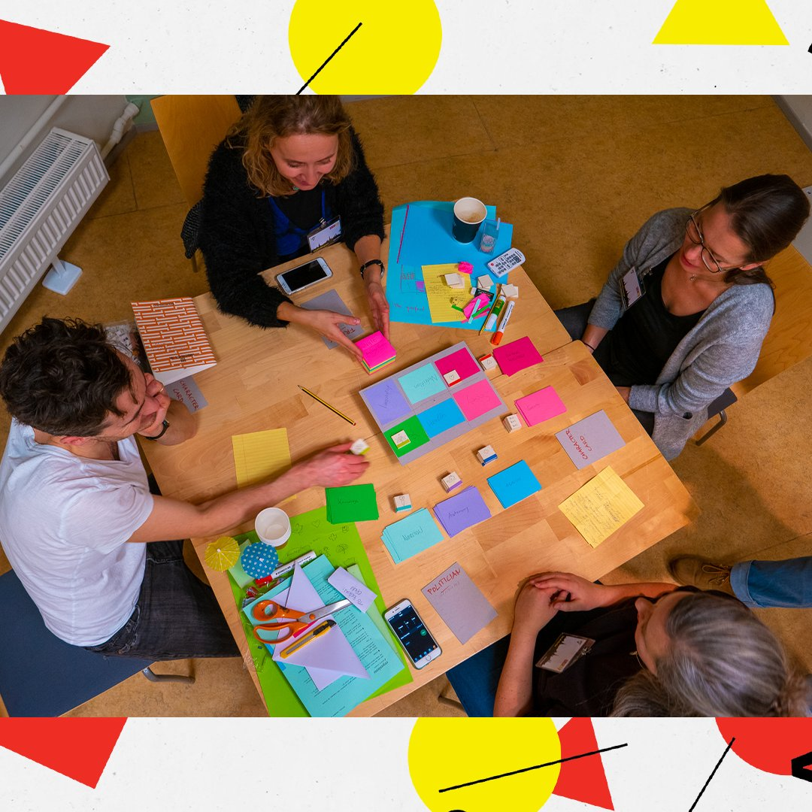

Play-On! is a large EC funded cultural project as part of Creative Europe, involving the [Digital Creativity Labs](https://digitalcreativity.ac.uk) and theatres in Austria, Estonia, Germany, Hungary, Italy, Norway, Poland, Portugal and the UK. In the project, we are collaborating to develop theatre productions that engage with the opportunities of immersive technologies, game design and interactive storytelling.

This is a huge project and more details on partners and [the different productions can be seen on the website](https://play-on.eu/productions/). My role is to lead the participation for DC Labs, which means working closely with various theatres, offering advice and feedback on how to engage with tech, help with R&D, work with partner universities and connecting companies with researchers working in these spaces.

It is an unusual project for me as it is cultural, and R&D weighted, rather than primarily for research, but I have absolutely loved it so far, working with dramaturgs and creative directors to explore the storytelling potential of different technologies, and seeing how that gets used in their productions. It is a brilliant opportunity to see directly how such tech is implemented and interpreted in theatre. Given the additional issues of 2020 - 2021, it has been a particularly challenging for theatres, but has been really inspirational to see how they have responded.

Play-On! also hosted an excellent online creative forum, [HOPE!, which is online and hosts a load of fascinating videos](https://play-on.eu/hopecreativeforum/) from creatives working in the space of immersive and interactive theatre.

Play-On! continues until 2024, so there is a huge amount to come.

