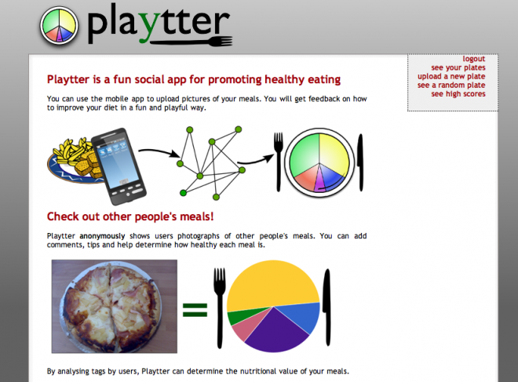
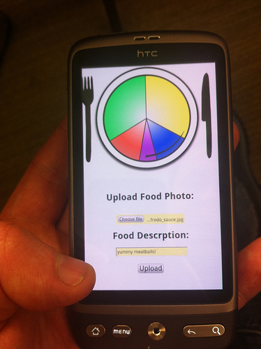
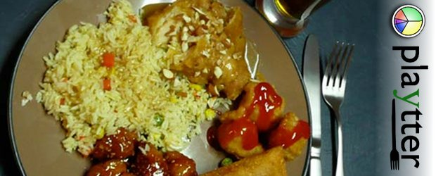

Playtter is a social nutrition application that allows users to upload pictures of food using their mobile phone camera, and then visit the website to get feedback on the quality of their nutritional intake. Web users are free to access Playtter and “tag” random meals with nutritional information, following the UK “Eatwell” healthy diet guidelines. The "Eatwell plate" was a visualisation of a plate as a pie chart with appropriate portions of protein, veg, starch, etc. Although extremely shady and political, this visualisation worked well as a bit of visual design.

Playtter is the result of a hack event, which is our excuse for the pure ugliness of the images, but as a proof of concept was interesting. (p.s. Play + Platter + Plating if you were scratching your head.)

Nutrition data for meals is generated based on aggregation of social opinion, and Playtter can then build up a profile of a user’s typical diet over the course of their usage. Using this longer term data, it is able to provide personalised recommendations to users based on their actual diet, as a social activity with other users.

It also demystifies diet in a couple of ways - first this is not an evasive magical AI promise, but a social activity, and also it works by consensus rather than appeal to a higher power (or lobby) on nutrition.

More information about the Playtter project is available on [the RewiredState projects pages](http://rewiredstate.org/projects/playtter).

Playtter is an evolution of a previous study into diet at LiSC called [Tag-liatelle](http://lisc.lincoln.ac.uk/health-and-wellbeing/tag-liatelle/). As a game designer, I went into Playtter trying to apply game design principles to make food diaries into a playful and light experience for the user. Dietary and other medical interventions can usually be so serious and depressing. I really wanted Playtter to appeal to the curious and playful natures – it is simple to upload photos and there are very few barriers to quickly seeing what people are eating. This for me is the essence of “gamification” – trying to make non-game tasks appeal to playful natures.

There is something really compelling about the voyeuristic aspect of seeing what other people are eating. The design tries to encourage this by using anonymity, and allowing non-users to contribute tags (the reward being to see more food). As you can see from the images from users here, British people enjoy some grim food.

* Conor Linehan, Mark Doughty, Shaun Lawson, Ben Kirman, Patrick Olivier, and Paula Moynihan (2010) [Tagliatelle: social tagging to encourage healthier eating](/papers/Linehan2010Tagging.pdf). In Proceedings of ACM SIGCHI Conference on Human Factors in Computer Systems Extended Abstracts. Atlanta, Georgia, USA
