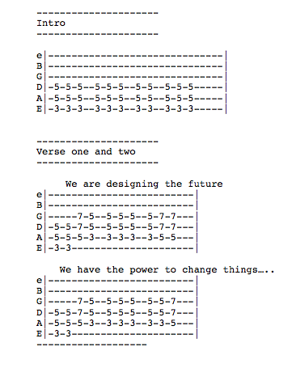

Something that has bothered me about Human-Computer Interaction (HCI) research for a while is the heavy slant of techno-utopian, "Silicon Valley"-type values associated with the way technology is presented. The conferences are sponsored by Microsoft, Google, Facebook, Bloomberg, Autodesk, and other suits with sandals, who also hire from the pool of researchers earnestly peddling this oily brand of tech that promises to change behaviour, improve "experience" and enrich lives. This grease is then spread over everything from eating habits to exercise to politics.

Conor and I somewhat opaquely challenged this with our [science fiction paper last year](/projects/evil-robots-from-the-future/) - all this short-term startup design thinking was founded on a ridiculous techno-utopian vision where new widgets lead to a wonderful future free of social and personal ills. We problematised that a bit by pointing out the potentially horrific dystopia they also might cause under those same logics, and the already troubling trends they enable. People laughed and clapped. We didn't think everyone got it.

This year, we tried to be a bit more direct, so we submitted a song to the [2014 Conference on Human Factors in Computer Systems (CHI).](http://chi2014.acm.org/) Yes, we submitted a song, one that suggested an alternative kind of HCI - one inspired as an "angry reaction against the status quo" \[1\]. We aren't sure if it is the only academic paper ever written in the form of guitar tabs, but we'd gamble there aren't many.

We never meant for it to be accepted (rejection would be a point of honour), but it was. [Our stupid punk song is in the ACM digital library](http://dl.acm.org/citation.cfm?id=2559206.2578880). We also had to present it, which caused us some problems. We delivered our presentation in the form of a 15 minute angry spiel, delivered as we paced up and down the aisle of the auditorium. I may be the only, still working, researcher who has ["flicked the V's"](http://web.archive.org/web/20081018230141/http://www.icons.org.uk/theicons/collection/the-v-sign/biography/v-for-get-stuffed) at a few hundred world-class thinkers.

The summary of the rant, from Conor \[1\]:

> I would argue that HCI papers that are presented as objective and apolitical, which are not concerned with values or politics, are quite likely to contain quite right-wing values. They suggest that we should let the market, rather than our collective knowledge, skills and expertise as researchers and scholars, decide what technology we should have, and how our societies should be effected by those technologies.
> 
> I would argue that if you don’t go about the design of technology specifically with values such as fairness, dignity and privacy as goals, then there is no reason why you should get those as outcomes. I think that there is value in nailing your political colours to the mast and letting your practice, or research, be guided by the fact that you value specific societal outcomes.
> 
> And there is value in presenting and overtly political paper at a computer science conference if it generates discussion on ideologies inherent in apparently objective and apolitical research agendas.

We were criticised several times for not performing the song. Performing the song would have been the worst possible thing to do – a horrific pastiche of punk by two overeducated wankers in front of an audience of beard-stroking latte-drinking tosspots. As Eric Baumer correctly pointed out, real punks wouldn’t even submit to an orthodox conference like CHI (rather favouring unconferences, maker faires, etc perhaps), however in this case the CHI community is never directly exposed to this perspective - they are "outside" and prevented from participation thanks to costs. We forced that angle into CHI a little, and provoked people to think about ideologies inherent in all HCI work (especially the right-wing bias of many big projects), even if the mode wasn’t optimal – we were more constrained than liberated by the punk format in the end. For perspective however, ours was the only paper that talked about the NSA scandal, of which some of the main sponsors of CHI – Google, Microsoft, Facebook and Yahoo – were complicit. The collective shrug that the community of researchers gave in reaction to this news is reason enough for me to strongly believe in the necessity of a Punk HCI to stand apart from this and design technology on its own terms.

Here is the paper: 

* Conor Linehan and Ben Kirman (2014) [Never mind the bollocks, I wanna be anarCHI: a manifesto for punk HCI](/papers/Linehan2014PunkHCI.pdf). Proceedings of ACM SIGCHI conference on Human Factors in Computing Systems extended abstracts. Toronto, Canada

On reflection this paper and presentation had some longer effects for me. Firstly, in meeting many sympathetic people in the CHI community since then, because of the talk. I've had several "Oh, you're one of the guys who did the punk song!" moments since, and some kindly saying it inspired them to be more forthright with their politics in their work, and helping establish politics in CHI discourse. It also directly led to me working with Tom Feltwell more, on things like the workshop on post-capitalism, and also doing more social justice projects with Oliver Bates (e.g. [Switch-Gig](/projects/switch-gig)), who I met thanks to our presentation. 

* Tom Feltwell, Shaun Lawson, Enrique Encinas, Conor Linehan, Ben Kirman, Deborah Maxwell, Tom Jenkins and Stacey Kuznetsov (2018) ["Grand Visions" for Post-Capitalist Human-Computer Interaction](/papers/Feltwell2018PostCapitalistHCI.pdf) (Workshop). Proceedings of Extended Abstracts of the ACM SIGCHI conference on Human Factors in Computing Systems (CHI 2018). Montréal, Canada.
* Oliver Bates, Carolynne Lord, Hayley Alter, and Ben Kirman (2020)  [Let’s start talking the walk: Capturing and reflecting on our limits when working with gig economy workers.](/papers/Bates2020TalktheWalk.pdf) In Proceedings of Sixth ACM Workshop on Computing within Limits (LIMITS 2020). Virtual.
* Oliver Bates & Ben Kirman (2019) [Sustainable Platform Cooperativism: Towards social and environmental justice in the future of the gig-economy](/papers/Bates2019SustainableCoop.pdf). Proceedings of the workshop on Computing within Limits (LIMITS 2019). Lappeenranta, Finland.

\[1\] [Read Conor's excellent piece about the paper at the Lincoln Social Computing Research Centre blog](http://lisc.lincoln.ac.uk/blog/2014/05/11/reflecting-on-the-making-of-a-political-speech-at-a-hci-conference/).

Also see [my longer blog entry about CHI 2014 in general at the LiSC site](http://lisc.lincoln.ac.uk/blog/2014/05/12/bens-chi2014-reflection/).

Cover image "This is all Bullshit", Handbill from the Diggers movement, San Francisco, 1967. 
