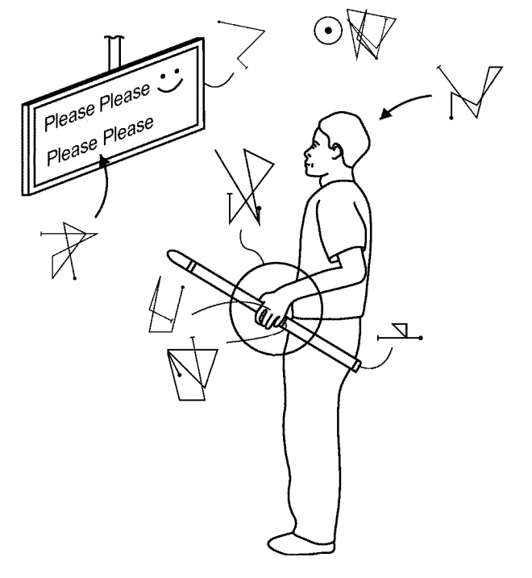
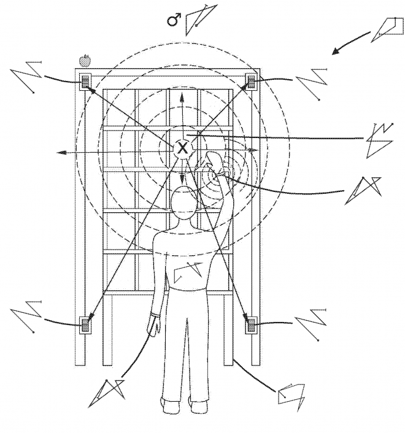
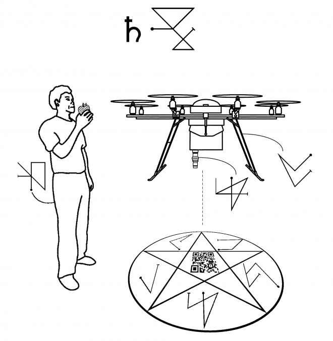

This is a strange one, even for me. I've been wanting to do something around "AI" and magic for years. Our understanding of AI is intentionally obscured and it is used in weird ways. AI experts and academics routinely move the goalposts (currently only Machine Learning is considered True AI™). Frequently, AI is just a codeword for "uncanny flowcharts", simple systems that trick us into attributing intelligence to graphs. Game AI is a classic example of this, as NPCs behave and respond intelligently through carefully designed (but computationally cheap) _if_ statements. AI and magic share a lot of features, they are both about the esoteric and arcane, and promise great power beyond human understanding.

In response to a call from the [Institute of Patent Infringement](https://work-body-leisure.hetnieuweinstituut.nl/open-call-patent-violation-institute-patent-infringement), I did a bit of work thinking/developing ways to interact with AI using tools and methods of magic, combined with a legal aesthetic that already is [occult-adjacent](https://www.youtube.com/watch?v=CkNfxHw5wo8). In particular I learned how to practice a form of [Chaos Magick](https://www.amazon.co.uk/Condensed-Chaos-Introduction-Occult-Studies/dp/1935150669 "non-referral Amazon link to Chaos Magick book"), as one of the more accessible occult practices. Like [Finite State Machines](https://en.wikipedia.org/wiki/Finite-state_machine) are for AI.

Anyway, I present the output for that, which is a narrative following a series of patent diagrams appropriated and modified from Amazon, that have been constructed using magickal processes and framing. The sources for the Amazon patents are referenced in the last paragraph.

`Automated, learning, and intelligent systems are the esoteric core of Amazon. The arcane nature of these ‘sufficiently advanced technologies’ means our experience with them is mystical, as we witness the conjuration of objects and data without understanding how these tricks are performed. This relationship of faith is one Amazon use to their advantage, and in the collection of patents we see humans reduced to inconvenient “agents” to be instrumented, controlled, predicted and exploited in service to the system. This document describes three inventions that use magick to exploit the mysticism of Amazon, radically reframing and subverting existing patents to instead define mechanisms where the human has the power to detect, contain and control the system and its learning autonomous agents: FIG 1 illustrates a divining rod for detection and identification of learning agents. Here the human is able to detect the domineering intentions of an artificial agent disguised by a whimsical interface.`

<figure>

<figcaption>FIGURE 1</figcaption>
</figure>

`FIG 2 illustrates a seal of protection invoked around a doorway by the human that prevents entry of an autonomous agent into a private space.`

<figure>

<figcaption>FIGURE 2</figcaption>
</figure>

`FIG 3 shows a pentacle of containment for attracting and containing autonomous learning agents within a clearly defined space created and monitored by the human.`

<figure>

<figcaption>FIGURE 3</figcaption>
</figure>

`These inventions are illustrated using repurposed imagery and subverted concepts from Amazon patents US09387928, US09792796 and US20170278051A1. The inventions use the principles and practice of chaos magick in their definition. Genuine magickal sigils have been carefully constructed to describe the desired behaviour of each component. Sigils have been designed using the Kamea (magick square) method, under the aspects of the Sun ( ☉ , personal power) , Mars ( ♂ , spear and shield for protection), and Saturn ( ♄ , authority) respectively. This document has been imbued with chaos magick in opposition to the artificial legal invocations of the original patents.`

I'd like to revisit this idea and do more. In the meantime check out the amazing paper on the topic of AI, magic and ritual by Kieran and Ben, in the same vein. At the presentation they performed a seance on stage, robes and all:

> Browne, Kieran, and Ben Swift. ["The Other Side: Algorithm as Ritual in Artificial Intelligence."](https://dl.acm.org/citation.cfm?id=3188404) Extended Abstracts of the 2018 CHI Conference on Human Factors in Computing Systems. ACM, 2018.
