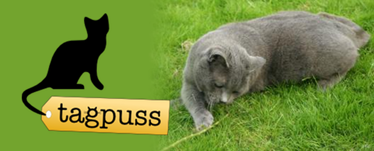

(2010) Understanding anthropomorphism of cats on the internet

In collaboration with the University of Lincoln Animal Behaviour, Cognition and Welfare Research Centre, we created Tagpuss, a web project that aims to investigate how people interpret the emotions of cats. Users are invited to contribute by tagging cat photographs. Each picture tagged supports the research into anthropomorphism and anyone can help as there is no need for any special skills. The website is free, easy to use, and is currently available to everyone.

The first aim of the Tagpuss study is to investigate the feasibility of using “citizen science” to study the field of animal behaviour. Secondly, we wish to investigate the feasibility of studying the field of attribution of emotions to animals and develop hypotheses to drive further research in the field.

To date, the study has been incredibly successful with over 66000 tags submitted to our repository of 1603 cat photographs from over 6000 active users. We recently introduced the capability for users of the site to enter their own tags for any image and also to upload their own cat photographs which will be available for tagging in the near future.

Tagpuss was created by the irrepressible [Derek Foster](http://www.derekfoster.net/), with collaborations from myself and the rest of LiSC.

What I really like about Tagpuss is the interaction flow. The users don’t need to register, and are immediately up and running generating data for the study. Also, one of the strongest findings is that it is _compelling_. Cat pictures are **intrinsically rewarding** for many people. We don’t need to dress it up with points and high-scores (e.g. like [The ESP Game](http://www.espgame.org/gwap/)), it is already a playful activity.

A lot of our inspiration for Tagpuss is from sites like [KittenWar](http://kittenwar.com/) and [RateMyKitten](http://www.ratemykitten.com/), taking the streamlined cat-based feedback loop and adding a crowdsourcing twist.

Derek Foster, Ben Kirman, Conor Linehan, Shaun Lawson, Daniel Mills, Sarah Ellis and Helen Zulch (2011) _“I Can Haz Emoshuns?”: understanding anthropomorphosis of cats among internet users_. Proceedings of the 3rd International Conference on Social Computing (SocialCom), Oct 9-11, MIT, Boston. ([pdf](http://eprints.lincoln.ac.uk/4654/))
