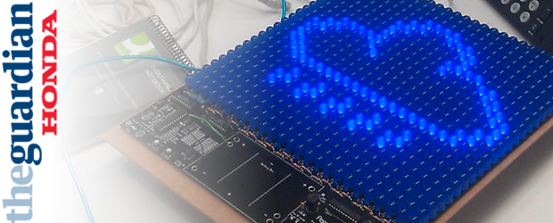
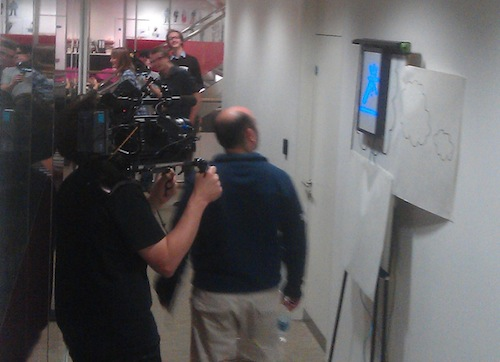

(2011) Ambient digital mindreading for office workers  

In 2011 I was recruited for a Rewired State hack on experimental prototype applications for Honda, as part of the Honda/Guardian "Dream Factory" event.

Gareth Lloyd and I worked on designing a passive digital installation art piece called "the Corridor of Dreams". It took the form of a lightbox framed in a "thought bubble" that would automatically detect passers-by, and using some clever AI algorithms™ determine their inner hopes and desires, which would instantly be reflected within the display.

Although quite a simple idea the implementation was technically challenging. We used the [LEGO NXT brick with ultrasonic sensors](http://mindstorms.lego.com/en-us/Default.aspx) to detect movement (in order to trigger the event), a USB webcam to capture the image of the approaching individual, [OpenCV](http://opencv.willowgarage.com/wiki/) to analyse the content of the image and an [Arduino](http://www.arduino.cc/)\-powered [“Peggy” display](http://evilmadscience.com/productsmenu/tinykitlist/75) Gareth constructed, in order to create the dream display. This was all plumbed together using Python, and deployed on a concealed [Ubuntu](http://www.ubuntu.com/) Nettop.

Although quite a simple and weird project prototype, it was fun to work on a creative installation that didn't need a highbrow concept and was just joyful to use.
