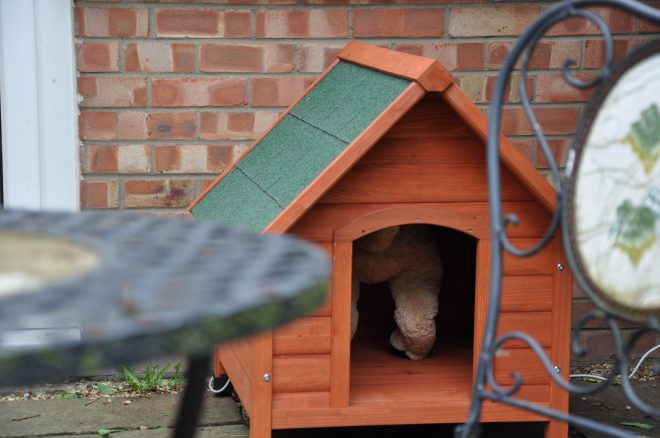
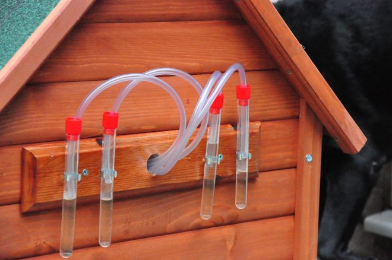
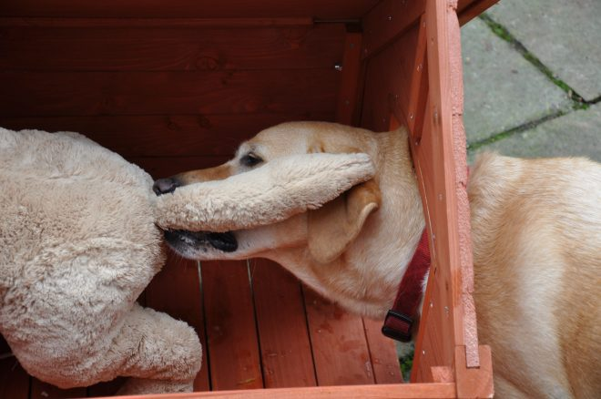
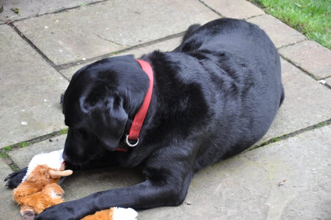
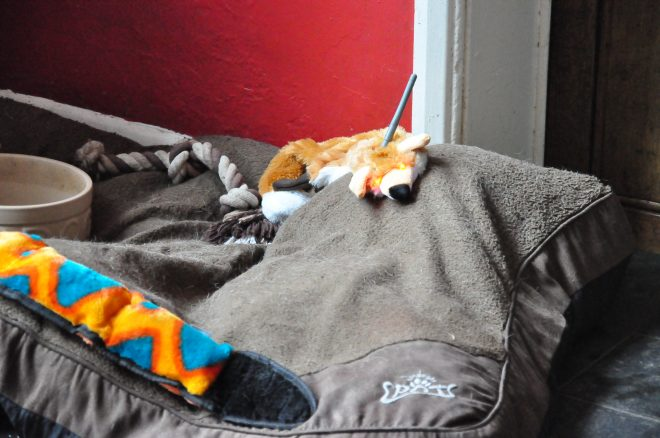

One of the key advancements in the design of computer interfaces has been around the consideration of user needs and experience. It has become imperative that systems are designed around the needs, values and capabilities of our users as a way to support interaction. There are countless tools and methods to support this design process - we interview, observe and measure interactions by users to help refine our designs. However, this user-centred design perspective fundamentally has a human perspective, and presumes a lot about the human-ness of the user.

What if the user is not human? What if the user has no understanding of what a computer is, let alone be able to understand how and why a particular system is useful?

This is a problem because the way we design technology for animals is very much grounded in human experiences. For tools, like the plough or the saddle, the relationship of the animal as part of the apparatus is considered, but using a comfortable yoke is a matter of productivity, like keeping a car engine oiled. Likewise, cats did not invent the laser pointer, but humans find it amusing to trick cats into chasing them even if it [may cause stress and anxiety](http://www.catteryalyona.com/kittens_Environmental_enrichment_JFMS.pdf) - it is still "cute" for the benefit of the human. How do we separate what an animal values in a design versus what we imagine, as humans, the animal values?

This is an intractable problem, but a problem that many designers don't think of at all when creating new technology for animals. A classic example is video games for pets. A game designer sees that a pet engages with a screen, so designs to maximise engagement, without really understanding how/why the animal is engaging at all. At some point, perhaps, they decide that it is "fun" for the animal but this is impossible to know. As such it may also be abusive.

Building on our [speculative design work on quantified pets in 2015](https://ben.kirman.org/projects/quantified-pets/), the Dog Internet is an intentionally absurd proposition, that aims to highlight the above questions.

As part of this we made a couple of prototypes, the DOG CAPTCHA, and the DOG RADAR.

DOG CAPTCHA is as modified dog kennel that is used as an interface to the Dog Internet. Just as CAPTCHAs are used to determine if a user is a robot or a human, DOG CAPTCHA is used to determine if a user is a dog or a human by asking them to perform a test where a fine mist of anal secretions are sprayed from a synthetic anus.

DOG RADAR is a dog toy enabled with Bluetooth sensors that is able to detect the proximity of humans and give dogs warnings so they can tidy up their [dog beer bottles](http://snuffle-dogbeer.com/) and clear their Dog Internet browser history.

You can read more about the project in our Interactions article:

* Shaun Lawson, Ben Kirman and Conor Linehan (2016) [Power, Participation and the Dog Internet](/papers/Lawson2016DogInternet.pdf). interactions 23.4 (July-August 2016 issue), ACM

...and see more details of the prototypes, in our paper from Research Through Design conference in 2017, where the DOG CAPTCHA and DOG RADAR were shown at the [National Museum of Scotland](https://www.nms.ac.uk/) in Edinburgh.

* Ben Kirman, Shaun Lawson and Conor Linehan (2017) [The Dog Internet: Autonomy and Interspecies Design](/papers/Kirman2017DogInternetRTD.pdf). In Proceedings of Research through Design Conference. Edinburgh, UK

We talk about the value of absurdity in design research here:

* Ben Kirman, Conor Linehan, and Shaun Lawson (2020) [What's Your Problem with the Dog Internet?](/papers/Kirman2020ProblemDogInternet.pdf) CHI EA '20: Extended Abstracts of the 2020 CHI Conference on Human Factors in Computing Systems. (Virtual)
