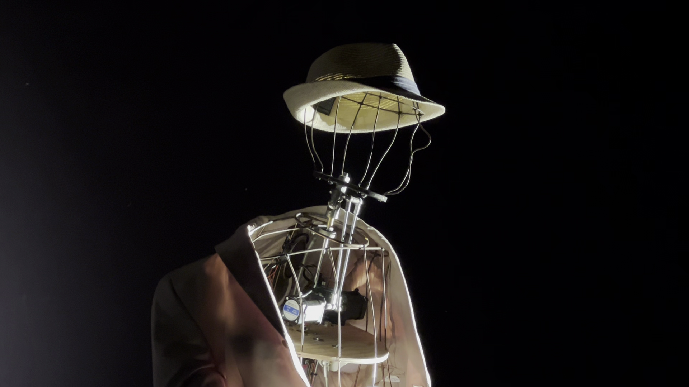
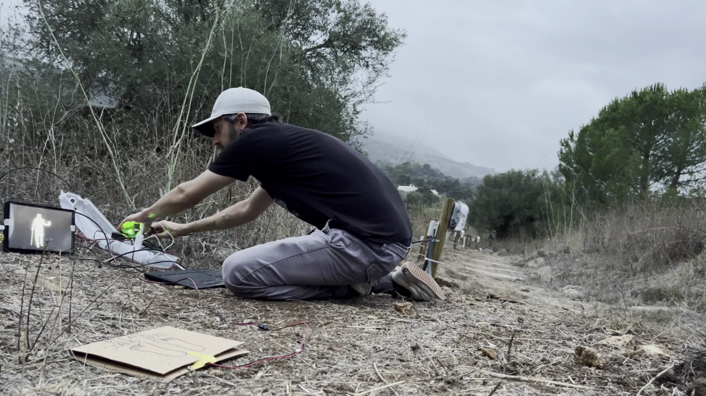

The final show I worked on as part of [PlayOn](/projects/play-on/) is appropriately the most ambitious and technically complex, also performed in the most challenging environment. It is therefore, also extremely exciting.

*Utopia Concreta: A Night of Daydreams* was written and directed by [Dirk Neldner](https://de.wikipedia.org/wiki/Dirk_Neldner), featuring Raul Atalaia, Marta Barahona, Nicolas Brites and Sara Belo. The technical directors were me, [Julian Jungel](https://julianjungel.de/) and [Nils Zweiling](https://zweiling.com/), audio was by Marius Zoschke and the show produced by Inês Gregório. The [full credits are on O Bando's website](http://www.obando.pt/pt/gca/index.php?id=261).
It was shown at Teatro O Bando, in Palmela, Portugal, in October 2024.

The show is an exploration of the philosophy of [Ernst Bloch](https://en.wikipedia.org/wiki/Ernst_Bloch), through a reflection and celebration of [50 years of theatre at O Bando](http://www.obando.pt/pt/english-version/o-bando/).

This exploration takes the form of a personal immersive audio walk at twilight, through the beautiful grounds of O Bando in the Vale dos Barris. As you walk around the valley, you encounter the echoes of the dozens of shows that O Bando has performed in those spaces, through giant props, interviews with artists, live singers and actors, an animatronic puppet of Ernst Bloch and many other surprises. This history is all reflected on themes of hope, dreams and utopia from Bloch's writing, and brought to life through immersive technology that is both carried and embedded into the valley itself.

The show is really meaningful and medititative, spectacular in its setting, and really unique in the ambition and scale of the production. You can read more about the show at [O Bando's website](http://www.obando.pt/pt/espectaculos/2018-2024/utopia-concreta-2024/) but here I'll talk mostly about the technical aspects where I worked closely with [Julian Jungel](https://julianjungel.de/) and [Nils Zweiling](https://zweiling.com/) to bring the show to life.

The technology included lots of moving parts that I could and would spend hours talking about, but some key aspects that were really fascinating: 

The audio walk was delivered by mobile app on phones provided by the theare, built using [OnScene](/projects/onscene). The show was in two languages (Portuguese and English) delivered simultaneously and independently to up to 20 audience members. The audio was recorded using binaural technologies by Marius Zoschke and the performers, and delivered to the audience binaurally through bone conducting wireless headphones. This was a specific choice to help you hear both the dialogue but also the ambient sounds of the environment, and it worked really well as an audio-augmented reality. It was hard to discern what is in the audio and what is in the real world, so there was a lot of interesting creative possibilities in merging the two.

The app runs itself with no interaction required, but audience members could press a button if they needed assistance. Because the show takes place at twilight on a rough path on a hillside, we had to provide lighting. To achieve this we wired up around 90 smart bulbs to an ad hoc [Zigbee](https://en.wikipedia.org/wiki/Zigbee) mesh network along the path (in waterproof enclosures) and Nils implemented an [MQTT](https://en.wikipedia.org/wiki/MQTT)-based protocol for animating the lights dynamically. In this way, the system knows where each audience member is, via the app, and can light up sections of the path (or change colour) based on what is happening during the audio, and in response to other things happening in the physical environment. This is extremely cool and very much like having a giant scale LED strip made of light bulbs that can be individually addressed and controlled.

Through the show we had several "stations" where events would occur in the story. For example, we hid projectors in the trees and projected interviews onto unexpected surfaces both small and huge. 

Julian used his electronics skills to enhance bench cushions using pressure sensors from car seat-belt alarm systems to detect when audience members sat down. With an API call from hidden [Raspberry Pis](https://www.raspberrypi.com/products/raspberry-pi-5/) to the app, it could then play a video or audio in the correct language for that person. Or, we could trigger the fantastic life size animated robotic puppet created by [Ingo Mewes](https://www.hfs-berlin.de/mensch/ingo-mewes/) and Julian at the [Hochschule für Schauspielkunst Ernst Busch](https://www.hfs-berlin.de/).

At various tricky points on the path, custom made [Raspberry Pi Pico](https://www.raspberrypi.com/products/raspberry-pi-pico-2/)-powered MQTT-connected LED lights could direct the audience through difficult junctions and indicate the safe route. All the audience members could be observed, and be supported, by technicians through GPS tracking to an [OnScene](/projects/onscene) powered control panel on an iPad in the main theatre building.

As you can see, the technical complexity was huge, and this was also made more difficult by the show being outside, at dusk, in the middle of the countryside. Although there were rough edges here and there, and unpredictable valley weather, and burst pipes, to contend with, it was fantastic to be able to get such an ambitious show to be enjoyed by audiences at O Bando. The combination of story, philosophy, hidden and visual technology together in such a rich environment really creates a magical experience.

Overall *Utopia Concreta* is a fantastic way to finish PlayOn! and really demonstrates the innovation and international cooperation at the heart of the project. I encourage you to check out the [rest of the amazing shows produced as part of the project](https://portal.theater.digital/). It has been a career highlight to be involved.

Thanks also to [Julian](https://julianjungel.de/)  for sharing the photographs.